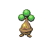

# Route 13 — Trainer Rosters

### Generic Trainers

| Trainer | P1 | P2 | P3 | P4 | P5 | P6 |
|:-------:|:--:|:--:|:--:|:--:|:--:|:--:|
|  Bird Keeper Bret |  Farfetch'd Lv. 59 |  Staraptor Lv. 59 |
|  Picnicker Piper |  Grumpig Lv. 58 |  Heracross Lv. 58 |
|  Bird Keeper Perry |  Tropius Lv. 61 |
| ") Young Couple Tim & Sue [(!)](#rematches) |  Golduck Lv. 59 |  Alakazam Lv. 59 |
|  Pokefan Joshua |  Pikachu Lv. 54 |  Bonsly Lv. 54 |  Smoochum Lv. 54 |  Magby Lv. 54 |  Elekid Lv. 54 |  Mime Jr. Lv. 54 |
|  Pokefan Alex |  Nidoking Lv. 58 |  Lopunny Lv. 58 |  Slowking Lv. 58 |
| ") Camper Tanner [(!)](#rematches) |  Hippowdon Lv. 61 |
|  Picnicker Ginger |  Masquerain Lv. 60 |
|  Camper Clark |  Floatzel Lv. 60 |
| ") Hiker Kenny [(!)](#rematches) |  Sandslash Lv. 59 |  Bronzong Lv. 59 |  Golem Lv. 59 |

### Rematches

| Trainer | P1 | P2 | P3 | P4 | P5 | P6 |
|:-------:|:--:|:--:|:--:|:--:|:--:|:--:|
| ") Young Couple T&S (F10a-8p) |  Golduck Lv. 62 |  Alakazam Lv. 62 |
| ") Young Couple T&S (F10a-8p) |  Golduck Lv. 66 |  Alakazam Lv. 66 |
| ") Young Couple T&S (F10a-8p) |  Golduck Lv. 69 |  Alakazam Lv. 69 |
| ") Camper Tanner (M8p-5a) |  Sudowoodo Lv. 63 |  Hippowdon Lv. 63 |
| ") Camper Tanner (M8p-5a) |  Sudowoodo Lv. 65 |  Hippowdon Lv. 65 |  Jumpluff Lv. 65 |
| ") Camper Tanner (M8p-5a) |  Sudowoodo Lv. 69 |  Hippowdon Lv. 69 |  Jumpluff Lv. 69 |
| ") Hiker Kenny (Sa10a-8p) |  Sandslash Lv. 62 |  Golem Lv. 62 |  Sudowoodo Lv. 62 |  Bronzong Lv. 62 |
| ") Hiker Kenny (Sa10a-8p) |  Sandslash Lv. 65 |  Golem Lv. 65 |  Sudowoodo Lv. 65 |  Bronzong Lv. 65 |
| ") Hiker Kenny (Sa10a-8p) |  Sandslash Lv. 68 |  Golem Lv. 68 |  Steelix Lv. 68 |  Sudowoodo Lv. 68 |  Bronzong Lv. 68 |

