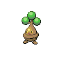
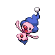

# Route 13 — Wild Pokémon

### Grass, Morning / Day

| Sprite | Pokémon | Encounter Type | Level | Chance |
|:------:|---------|:--------------:|-------|--------|
|  | Nidorina | {: style="max-width: 24px;"" } {: style="max-width: 24px;"" } {: style="max-width: 24px;"" } | 50 – 54 | 25% |
|  | Nidorino | {: style="max-width: 24px;"" } {: style="max-width: 24px;"" } {: style="max-width: 24px;"" } | 50 – 54 | 25% |
|  | Swellow | {: style="max-width: 24px;"" } {: style="max-width: 24px;"" } {: style="max-width: 24px;"" } | 50 – 54 | 20% |
|  | Skiploom | {: style="max-width: 24px;"" } {: style="max-width: 24px;"" } {: style="max-width: 24px;"" } | 50 – 54 | 20% |
|  | Farfetch’d | {: style="max-width: 24px;"" } {: style="max-width: 24px;"" } {: style="max-width: 24px;"" } | 50 – 54 | 10% |

### Grass, Night

| Sprite | Pokémon | Encounter Type | Level | Chance |
|:------:|---------|:--------------:|-------|--------|
|  | Nidorina | {: style="max-width: 24px;"" } {: style="max-width: 24px;"" } | 50 – 54 | 25% |
|  | Nidorino | {: style="max-width: 24px;"" } {: style="max-width: 24px;"" } | 50 – 54 | 25% |
|  | Swellow | {: style="max-width: 24px;"" } {: style="max-width: 24px;"" } | 50 – 54 | 20% |
|  | Quagsire | {: style="max-width: 24px;"" } {: style="max-width: 24px;"" } | 50 – 54 | 20% |
|  | Noctowl | {: style="max-width: 24px;"" } {: style="max-width: 24px;"" } | 50 – 54 | 10% |

### Meridian Sound

| Sprite | Pokémon | Encounter Type | Level | Chance |
|:------:|---------|:--------------:|-------|--------|
|  | Jumpluff | {: style="max-width: 24px;"" } | 50 – 54 | 100% |

### Pastoral Sound

| Sprite | Pokémon | Encounter Type | Level | Chance |
|:------:|---------|:--------------:|-------|--------|
|  | Bonsly | {: style="max-width: 24px;"" } | 50 – 54 | 50% |
|  | Mime Jr. | {: style="max-width: 24px;"" } | 50 – 54 | 50% |

### Swarm

| Sprite | Pokémon | Encounter Type | Level | Chance |
|:------:|---------|:--------------:|-------|--------|
|  | Chansey | {: style="max-width: 24px;"" } | 50 – 54 | 100% |

### Surf

| Sprite | Pokémon | Encounter Type | Level | Chance |
|:------:|---------|:--------------:|-------|--------|
|  | Slowpoke | {: style="max-width: 24px;"" } | 50 – 54 | 90% |
|  | Slowbro | {: style="max-width: 24px;"" } | 50 – 54 | 10% |

### Old Rod

| Sprite | Pokémon | Encounter Type | Level | Chance |
|:------:|---------|:--------------:|-------|--------|
|  | Magikarp | {: style="max-width: 24px;"" } | 10 | 100% |

### Good Rod

| Sprite | Pokémon | Encounter Type | Level | Chance |
|:------:|---------|:--------------:|-------|--------|
|  | Poliwag | {: style="max-width: 24px;"" } | 25 | 60% |
|  | Goldeen | {: style="max-width: 24px;"" } | 25 | 30% |
|  | Horsea | {: style="max-width: 24px;"" } | 25 | 10% |

### Super Rod

| Sprite | Pokémon | Encounter Type | Level | Chance |
|:------:|---------|:--------------:|-------|--------|
|  | Seadra | {: style="max-width: 24px;"" } | 50 | 60% |
|  | Poliwhirl | {: style="max-width: 24px;"" } | 50 | 30% |
|  | Qwilfish | {: style="max-width: 24px;"" } | 50 | 10% |

