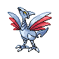

# Route 14 — Trainer Rosters

### Generic Trainers

| Trainer | P1 | P2 | P3 | P4 | P5 | P6 |
|:-------:|:--:|:--:|:--:|:--:|:--:|:--:|
| ") Bird Keeper Josh [(!)](#rematches) |  Altaria Lv. 60 |
|  Pokefan Trevor |  Jumpluff Lv. 61 |
|  Pokefan Carter |  Venusaur Lv. 60 |  Blastoise Lv. 60 |  Charizard Lv. 60 |
|  Bird Keeper Roy |  Togetic Lv. 59 |  Dodrio Lv. 59 |
|  School Kid Connor |  Linoone Lv. 62 |
| ") School Kid Torin [(!)](#rematches) |  Sandslash Lv. 57 |  Castform Lv. 57 |
|  Teacher Clarice |  Linoone Lv. 60 |  Roserade Lv. 60 |
|  School Kid Travis |  Glalie Lv. 58 |

### Rematches

| Trainer | P1 | P2 | P3 | P4 | P5 | P6 |
|:-------:|:--:|:--:|:--:|:--:|:--:|:--:|
| ") Bird Keeper Josh (T8p-5a) |  Altaria Lv. 64 |  Skarmory Lv. 64 |
| ") Bird Keeper Josh (T8p-5a) |  Skarmory Lv. 66 |  Altaria Lv. 66 |
| ") Bird Keeper Josh (T8p-5a) |  Skarmory Lv. 70 |  Altaria Lv. 70 |
| ") School Kid Torin (W8p-5a) |  Sandslash Lv. 62 |  Golbat Lv. 62 |  Castform Lv. 62 |
| ") School Kid Torin (W8p-5a) |  Sandslash Lv. 65 |  Golbat Lv. 65 |  Castform Lv. 65 |
| ") School Kid Torin (W8p-5a) |  Sandslash Lv. 68 |  Crobat Lv. 68 |  Castform Lv. 68 |

