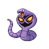

# Route 17 — Trainer Rosters

### Generic Trainers

| Trainer | P1 | P2 | P3 | P4 | P5 | P6 |
|:-------:|:--:|:--:|:--:|:--:|:--:|:--:|
| ") Biker Ernest [(!)](#rematches) |  Ursaring Lv. 61 |  Zangoose Lv. 61 |
|  Biker Markey |  Toxicroak Lv. 61 |
|  Biker Teddy |  Seviper Lv. 61 |
|  Biker Glenn |  Electrode Lv. 58 |  Ninjask Lv. 58 |  Magmar Lv. 58 |
|  Biker Dan |  Swalot Lv. 59 |  Weezing Lv. 59 |  Aggron Lv. 59 |
|  Biker Theron |  Gabite Lv. 60 |
| ") Biker Aiden [(!)](#rematches) |  Houndoom Lv. 61 |
|  Biker Joel |  Magmar Lv. 60 |  Electabuzz Lv. 60 |
|  Biker Jacob |  Aerodactyl Lv. 60 |  Tentacruel Lv. 60 |
| ") Biker Reese [(!)](#rematches) |  Weezing Lv. 59 |
|  Biker Dale |  Vibrava Lv. 59 |

### Rematches

| Trainer | P1 | P2 | P3 | P4 | P5 | P6 |
|:-------:|:--:|:--:|:--:|:--:|:--:|:--:|
| ") Biker Ernest (Su10a-8p) |  Zangoose Lv. 62 |  Ursaring Lv. 62 |
| ") Biker Ernest (Su10a-8p) |  Zangoose Lv. 65 |  Ursaring Lv. 65 |
| ") Biker Ernest (Su10a-8p) |  Zangoose Lv. 69 |  Ursaring Lv. 69 |
| ") Biker Aiden (M4a-10a) |  Houndoom Lv. 63 |  Tentacruel Lv. 63 |
| ") Biker Aiden (M4a-10a) |  Houndoom Lv. 66 |  Tentacruel Lv. 66 |
| ") Biker Aiden (M4a-10a) |  Houndoom Lv. 68 |  Machamp Lv. 68 |  Tentacruel Lv. 68 |
| ") Biker Reese (Su8p-5a) |  Arbok Lv. 62 |  Weezing Lv. 62 |
| ") Biker Reese (Su8p-5a) |  Arbok Lv. 66 |  Weezing Lv. 66 |
| ") Biker Reese (Su8p-5a) |  Arbok Lv. 69 |  Weezing Lv. 69 |

