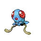

# Route 19 Wild Pokémon

### Surf

| Sprite | Pokémon | Encounter Type | Level | Chance |
|:------:|---------|:--------------:|-------|--------|
|  | Tentacool | {: style="max-width: 24px;"" } | 5 – 60 | 60% |
|  | Wingull | {: style="max-width: 24px;"" } | 5 – 60 | 30% |
|  | Pelipper | {: style="max-width: 24px;"" } | 5 – 60 | 5% |
|  | Mantine | {: style="max-width: 24px;"" } | 5 – 60 | 5% |

### Swarm

| Sprite | Pokémon | Encounter Type | Level | Chance |
|:------:|---------|:--------------:|-------|--------|
|  | Mantine | {: style="max-width: 24px;"" } | 5 – 60 | Surf |

### Old Rod

| Sprite | Pokémon | Encounter Type | Level | Chance |
|:------:|---------|:--------------:|-------|--------|
|  | Magikarp | {: style="max-width: 24px;"" } | 10 | 90% |
|  | Goldeen | {: style="max-width: 24px;"" } | 10 | 10% |

### Good Rod

| Sprite | Pokémon | Encounter Type | Level | Chance |
|:------:|---------|:--------------:|-------|--------|
|  | Goldeen | {: style="max-width: 24px;"" } | 25 | 60% |
|  | Finneon | {: style="max-width: 24px;"" } | 25 | 30% |
|  | Clamperl | {: style="max-width: 24px;"" } | 25 | 10% |

### Super Rod

| Sprite | Pokémon | Encounter Type | Level | Chance |
|:------:|---------|:--------------:|-------|--------|
|  | Lumineon | {: style="max-width: 24px;"" } | 50 | 60% |
|  | Seaking | {: style="max-width: 24px;"" } | 50 | 30% |
|  | Huntail | {: style="max-width: 24px;"" } | 50 | 5% |
|  | Gorebyss | {: style="max-width: 24px;"" } | 50 | 5% |

### Rock Smash

| Sprite | Pokémon | Encounter Type | Level | Chance |
|:------:|---------|:--------------:|-------|--------|
|  | Krabby | {: style="max-width: 24px;"" } | 5 – 60 | 90% |
|  | Kingler | {: style="max-width: 24px;"" } | 5 – 60 | 10% |

