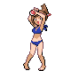

# Route 20 — Trainer Rosters

---

## East

### Generic Trainers

| Trainer | P1 | P2 | P3 | P4 | P5 | P6 |
|:-------:|:--:|:--:|:--:|:--:|:--:|:--:|
|  Swimmer Nicole |  Azumarill Lv. 62 |  Lapras Lv. 62 |  Dewgong Lv. 62 |
|  Swimmer Lori |  Starmie Lv. 62 |  Gyarados Lv. 62 |  Milotic Lv. 62 |
|  Swimmer Elmo |  Poliwrath Lv. 63 |  Tentacruel Lv. 63 |
|  Swimmer Luis |  Pelipper Lv. 64 |  Quagsire Lv. 64 |
|  Camper Pedro |  Linoone Lv. 65 |

---

## West

### Generic Trainers

| Trainer | P1 | P2 | P3 | P4 | P5 | P6 |
|:-------:|:--:|:--:|:--:|:--:|:--:|:--:|
|  Picnicker Adrian |  Kirlia Lv. 63 |  Torterra Lv. 63 |
|  Swimmer Leona |  Bibarel Lv. 65 |
|  Bird Keeper Ernie |  Staraptor Lv. 65 |
|  Picnicker Cheyenne |  Vibrava Lv. 63 |  Empoleon Lv. 63 |
|  Swimmer Mina |  Luvdisc Lv. 63 |  Lumineon Lv. 63 |  Octillery Lv. 63 |
|  Bird Keeper Bert |  Xatu Lv. 62 |  Dodrio Lv. 62 |
|  Swimmer Frankie |  Blastoise Lv. 64 |

