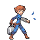
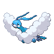
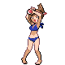
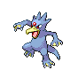
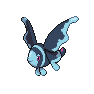
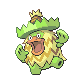
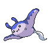
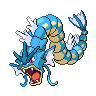
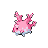
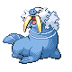

# Route 21 — Trainer Rosters

### Generic Trainers

| Trainer | P1 | P2 | P3 | P4 | P5 | P6 |
|:-------:|:--:|:--:|:--:|:--:|:--:|:--:|
|  Bird Keeper Easton |  Dodrio Lv. 63 |  Farfetch'd Lv. 63 |  Staraptor Lv. 63 |  Altaria Lv. 63 |
|  Swimmer Esteban |  Golduck Lv. 64 |  Starmie Lv. 64 |
|  Swimmer Duane |  Lumineon Lv. 64 |  Ludicolo Lv. 64 |
|  Fisherman Gideon |  Lanturn Lv. 63 |  Mantine Lv. 63 |
|  Swimmer Tyson |  Quagsire Lv. 64 |  Octillery Lv. 64 |
|  Fisherman Liam |  Gyarados Lv. 65 |
|  Swimmer Chelan |  Azumarill Lv. 65 |
|  Fisherman Murphy |  Corsola Lv. 63 |  Corsola Lv. 63 |  Corsola Lv. 63 |  Corsola Lv. 63 |
|  Bird Keeper Kinsley |  Farfetch'd Lv. 63 |  Fearow Lv. 63 |  Pelipper Lv. 63 |
|  Fisherman Arnold |  Slowbro Lv. 64 |
|  Swimmer Nikki |  Dewgong Lv. 64 |  Walrein Lv. 64 |

