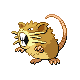
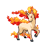
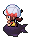
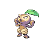

# Route 22 — Wild Pokémon

### Grass

| Sprite | Pokémon | Encounter Type | Level | Chance |
|:------:|---------|:--------------:|-------|--------|
|  | Fearow | {: style="max-width: 24px;"" } | 54 – 59 | 30% |
|  | Dodrio | {: style="max-width: 24px;"" } | 54 – 59 | 30% |
|  | Raticate | {: style="max-width: 24px;"" } | 54 – 59 | 15% |
|  | Primeape | {: style="max-width: 24px;"" } | 54 – 59 | 15% |
|  | Rapidash | {: style="max-width: 24px;"" } | 54 – 59 | 10% |

### Surf

| Sprite | Pokémon | Encounter Type | Level | Chance |
|:------:|---------|:--------------:|-------|--------|
|  | Poliwag | {: style="max-width: 24px;"" } | 54 – 59 | 63% |
|  | Buizel | {: style="max-width: 24px;"" } | 54 – 59 | 37% |

### Meridian Sound

| Sprite | Pokémon | Encounter Type | Level | Chance |
|:------:|---------|:--------------:|-------|--------|
|  | Poliwhirl | {: style="max-width: 24px;"" } | 54 – 59 | 100% |

### Pastoral Sound

| Sprite | Pokémon | Encounter Type | Level | Chance |
|:------:|---------|:--------------:|-------|--------|
|  | Lombre | {: style="max-width: 24px;"" } | 54 – 59 | 50% |
|  | Nuzleaf | {: style="max-width: 24px;"" } | 54 – 59 | 50% |

### Old Rod

| Sprite | Pokémon | Encounter Type | Level | Chance |
|:------:|---------|:--------------:|-------|--------|
|  | Poliwag | {: style="max-width: 24px;"" } | 10 | 100% |

### Good Rod

| Sprite | Pokémon | Encounter Type | Level | Chance |
|:------:|---------|:--------------:|-------|--------|
|  | Poliwag | {: style="max-width: 24px;"" } | 25 | 100% |

### Super Rod

| Sprite | Pokémon | Encounter Type | Level | Chance |
|:------:|---------|:--------------:|-------|--------|
|  | Poliwhirl | {: style="max-width: 24px;"" } | 50 | 98% |
|  | Politoed | {: style="max-width: 24px;"" } | 50 | 2% |

