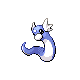

# Route 25 — Wild Pokémon

### Grass, Morning / Day

| Sprite | Pokémon | Encounter Type | Level | Chance |
|:------:|---------|:--------------:|-------|--------|
|  | [Sunkern](../../pokemon/sunkern.md) | {: style="max-width: 24px;"" } {: style="max-width: 24px;"" } {: style="max-width: 24px;"" }| 47 – 52 | 20% |
|  | [Buneary](../../pokemon/buneary.md) | {: style="max-width: 24px;"" } {: style="max-width: 24px;"" } {: style="max-width: 24px;"" }| 47 – 52 | 20% |
|  | [Vigoroth](../../pokemon/vigoroth.md) | {: style="max-width: 24px;"" } {: style="max-width: 24px;"" } {: style="max-width: 24px;"" }| 47 – 52 | 15% |
|  | [Combee](../../pokemon/combee.md) | {: style="max-width: 24px;"" } {: style="max-width: 24px;"" } {: style="max-width: 24px;"" }| 47 – 52 | 15% |
|  | [Weepinbell](../../pokemon/weepinbell.md) | {: style="max-width: 24px;"" } {: style="max-width: 24px;"" } {: style="max-width: 24px;"" }| 47 – 52 | 15% |
|  | [Exeggcute](../../pokemon/exeggcute.md) | {: style="max-width: 24px;"" } {: style="max-width: 24px;"" } {: style="max-width: 24px;"" }| 47 – 52 | 15% |

### Grass, Night

| Sprite | Pokémon | Encounter Type | Level | Chance |
|:------:|---------|:--------------:|-------|--------|
|  | [Venomoth](../../pokemon/venomoth.md) | {: style="max-width: 24px;"" } {: style="max-width: 24px;"" }| 47 – 52 | 20% |
|  | [Buneary](../../pokemon/buneary.md) | {: style="max-width: 24px;"" } {: style="max-width: 24px;"" }| 47 – 52 | 20% |
|  | [Vigoroth](../../pokemon/vigoroth.md) | {: style="max-width: 24px;"" } {: style="max-width: 24px;"" }| 47 – 52 | 15% |
|  | [Combee](../../pokemon/combee.md) | {: style="max-width: 24px;"" } {: style="max-width: 24px;"" }| 47 – 52 | 15% |
|  | [Weepinbell](../../pokemon/weepinbell.md) | {: style="max-width: 24px;"" } {: style="max-width: 24px;"" }| 47 – 52 | 15% |
|  | [Exeggcute](../../pokemon/exeggcute.md) | {: style="max-width: 24px;"" } {: style="max-width: 24px;"" }| 47 – 52 | 15% |

### Meridian Sound

| Sprite | Pokémon | Encounter Type | Level | Chance |
|:------:|---------|:--------------:|-------|--------|
|  | [Sunflora](../../pokemon/sunflora.md) | {: style="max-width: 24px;"" }| 47 – 52 | 50% |
|  | [Lopunny](../../pokemon/lopunny.md) | {: style="max-width: 24px;"" }| 47 – 52 | 50% |

### Pastoral Sound

| Sprite | Pokémon | Encounter Type | Level | Chance |
|:------:|---------|:--------------:|-------|--------|
|  | [Venonat](../../pokemon/venonat.md) | {: style="max-width: 24px;"" }| 47 – 52 | 50% |
|  | [Slakoth](../../pokemon/slakoth.md) | {: style="max-width: 24px;"" }| 47 – 52 | 50% |

### Swarm

| Sprite | Pokémon | Encounter Type | Level | Chance |
|:------:|---------|:--------------:|-------|--------|
|  | [Lairon](../../pokemon/lairon.md) | {: style="max-width: 24px;"" }| 47 – 52 | 100% |

### Surf

| Sprite | Pokémon | Encounter Type | Level | Chance |
|:------:|---------|:--------------:|-------|--------|
|  | [Hoppip](../../pokemon/hoppip.md) | {: style="max-width: 24px;"" }| 47 – 52 | 60% |
|  | [Goldeen](../../pokemon/goldeen.md) | {: style="max-width: 24px;"" }| 47 – 52 | 30% |
|  | [Skiploom](../../pokemon/skiploom.md) | {: style="max-width: 24px;"" }| 47 – 52 | 7% |
|  | [Masquerain](../../pokemon/masquerain.md) | {: style="max-width: 24px;"" }| 47 – 52 | 3% |

### Old Rod

| Sprite | Pokémon | Encounter Type | Level | Chance |
|:------:|---------|:--------------:|-------|--------|
|  | [Magikarp](../../pokemon/magikarp.md) | {: style="max-width: 24px;"" }| 10 | 60% |
|  | [Goldeen](../../pokemon/goldeen.md) | {: style="max-width: 24px;"" }| 10 | 30% |
|  | [Seaking](../../pokemon/seaking.md) | {: style="max-width: 24px;"" }| 10 | 10% |

### Good Rod

| Sprite | Pokémon | Encounter Type | Level | Chance |
|:------:|---------|:--------------:|-------|--------|
|  | [Goldeen](../../pokemon/goldeen.md) | {: style="max-width: 24px;"" }| 25 | 90% |
|  | [Seaking](../../pokemon/seaking.md) | {: style="max-width: 24px;"" }| 25 | 10% |

### Super Rod

| Sprite | Pokémon | Encounter Type | Level | Chance |
|:------:|---------|:--------------:|-------|--------|
|  | [Staryu](../../pokemon/staryu.md) | {: style="max-width: 24px;"" }| 50 | 60% |
|  | [Seaking](../../pokemon/seaking.md) | {: style="max-width: 24px;"" }| 50 | 30% |
|  | [Dratini](../../pokemon/dratini.md) | {: style="max-width: 24px;"" }| 50 | 7% |
|  | [Dragonair](../../pokemon/dragonair.md) | {: style="max-width: 24px;"" }| 50 | 3% |

