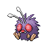

# Route 25 — Wild Pokémon

### Grass, Morning / Day

| Sprite | Pokémon | Encounter Type | Level | Chance |
|:------:|---------|:--------------:|-------|--------|
|  | Sunkern | {: style="max-width: 24px;"" } {: style="max-width: 24px;"" } {: style="max-width: 24px;"" } | 47 – 52 | 20% |
|  | Buneary | {: style="max-width: 24px;"" } {: style="max-width: 24px;"" } {: style="max-width: 24px;"" } | 47 – 52 | 20% |
|  | Vigoroth | {: style="max-width: 24px;"" } {: style="max-width: 24px;"" } {: style="max-width: 24px;"" } | 47 – 52 | 15% |
|  | Combee | {: style="max-width: 24px;"" } {: style="max-width: 24px;"" } {: style="max-width: 24px;"" } | 47 – 52 | 15% |
|  | Weepinbell | {: style="max-width: 24px;"" } {: style="max-width: 24px;"" } {: style="max-width: 24px;"" } | 47 – 52 | 15% |
|  | Exeggcute | {: style="max-width: 24px;"" } {: style="max-width: 24px;"" } {: style="max-width: 24px;"" } | 47 – 52 | 15% |

### Grass, Night

| Sprite | Pokémon | Encounter Type | Level | Chance |
|:------:|---------|:--------------:|-------|--------|
|  | Venomoth | {: style="max-width: 24px;"" } {: style="max-width: 24px;"" } | 47 – 52 | 20% |
|  | Buneary | {: style="max-width: 24px;"" } {: style="max-width: 24px;"" } | 47 – 52 | 20% |
|  | Vigoroth | {: style="max-width: 24px;"" } {: style="max-width: 24px;"" } | 47 – 52 | 15% |
|  | Combee | {: style="max-width: 24px;"" } {: style="max-width: 24px;"" } | 47 – 52 | 15% |
|  | Weepinbell | {: style="max-width: 24px;"" } {: style="max-width: 24px;"" } | 47 – 52 | 15% |
|  | Exeggcute | {: style="max-width: 24px;"" } {: style="max-width: 24px;"" } | 47 – 52 | 15% |

### Meridian Sound

| Sprite | Pokémon | Encounter Type | Level | Chance |
|:------:|---------|:--------------:|-------|--------|
|  | Sunflora | {: style="max-width: 24px;"" } | 47 – 52 | 50% |
|  | Lopunny | {: style="max-width: 24px;"" } | 47 – 52 | 50% |

### Pastoral Sound

| Sprite | Pokémon | Encounter Type | Level | Chance |
|:------:|---------|:--------------:|-------|--------|
|  | Venonat | {: style="max-width: 24px;"" } | 47 – 52 | 50% |
|  | Slakoth | {: style="max-width: 24px;"" } | 47 – 52 | 50% |

### Swarm

| Sprite | Pokémon | Encounter Type | Level | Chance |
|:------:|---------|:--------------:|-------|--------|
|  | Lairon | {: style="max-width: 24px;"" } | 47 – 52 | 100% |

### Surf

| Sprite | Pokémon | Encounter Type | Level | Chance |
|:------:|---------|:--------------:|-------|--------|
|  | Hoppip | {: style="max-width: 24px;"" } | 47 – 52 | 60% |
|  | Goldeen | {: style="max-width: 24px;"" } | 47 – 52 | 30% |
|  | Skiploom | {: style="max-width: 24px;"" } | 47 – 52 | 7% |
|  | Masquerain | {: style="max-width: 24px;"" } | 47 – 52 | 3% |

### Old Rod

| Sprite | Pokémon | Encounter Type | Level | Chance |
|:------:|---------|:--------------:|-------|--------|
|  | Magikarp | {: style="max-width: 24px;"" } | 10 | 60% |
|  | Goldeen | {: style="max-width: 24px;"" } | 10 | 30% |
|  | Seaking | {: style="max-width: 24px;"" } | 10 | 10% |

### Good Rod

| Sprite | Pokémon | Encounter Type | Level | Chance |
|:------:|---------|:--------------:|-------|--------|
|  | Goldeen | {: style="max-width: 24px;"" } | 25 | 90% |
|  | Seaking | {: style="max-width: 24px;"" } | 25 | 10% |

### Super Rod

| Sprite | Pokémon | Encounter Type | Level | Chance |
|:------:|---------|:--------------:|-------|--------|
|  | Staryu | {: style="max-width: 24px;"" } | 50 | 60% |
|  | Seaking | {: style="max-width: 24px;"" } | 50 | 30% |
|  | Dratini | {: style="max-width: 24px;"" } | 50 | 7% |
|  | Dragonair | {: style="max-width: 24px;"" } | 50 | 3% |

