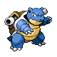

# Trainer Rosters

### Generic Trainers

| Trainer | P1 | P2 | P3 | P4 | P5 | P6 |
|:-------:|:--:|:--:|:--:|:--:|:--:|:--:|
|  Fisherman Scott |  Gyarados Lv. 47 |  Qwilfish Lv. 47 |  Wailord Lv. 47 |
|  Psychic Vernon |  Metang Lv. 48 |  Dusclops Lv. 48 |  Claydol Lv. 48 |
|  Ace Trainer Joyce |  Raichu Lv. 49 |  Charizard Lv. 49 |  Blastoise Lv. 49 |  Meganium Lv. 49 |
| ") Ace Trainer Gaven [(!)](#rematches) |  Ambipom Lv. 48 |  Porygon-Z Lv. 48 |  Sceptile Lv. 48 |  Ampharos Lv. 48 |  Rampardos Lv. 48 |
|  Ace Trainer Jake |  Ludicolo Lv. 50 |  Luxray Lv. 50 |  Blaziken Lv. 50 |
| ") Ace Trainer Jamie [(!)](#rematches) |  Tauros Lv. 51 |  Medicham Lv. 51 |

### Rematches

| Trainer | P1 | P2 | P3 | P4 | P5 | P6 |
|:-------:|:--:|:--:|:--:|:--:|:--:|:--:|
| ") Ace Trainer Gaven (Th4a-10a) |  Ambipom Lv. 50 |  Porygon-Z Lv. 50 |  Sceptile Lv. 50 |  Ampharos Lv. 50 |  Rampardos Lv. 50 |
| ") Ace Trainer Gaven (Th4a-10a) |  Ambipom Lv. 53 |  Porygon-Z Lv. 53 |  Sceptile Lv. 53 |  Ampharos Lv. 53 |  Rampardos Lv. 53 |
| ") Ace Trainer Gaven (Th4a-10a) |  Ambipom Lv. 68 |  Porygon-Z Lv. 68 |  Sceptile Lv. 68 |  Ampharos Lv. 68 |  Rampardos Lv. 68 |
| ") Ace Trainer Jamie (F10a-8p) |  Tauros Lv. 53 |  Medicham Lv. 53 |
| ") Ace Trainer Jamie (F10a-8p) |  Tauros Lv. 56 |  Medicham Lv. 56 |
| ") Ace Trainer Jamie (F10a-8p) |  Tauros Lv. 72 |  Medicham Lv. 72 |

