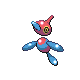

# Route 26 — Trainer Rosters

### Generic Trainers

| Trainer | P1 | P2 | P3 | P4 | P5 | P6 |
|:-------:|:--:|:--:|:--:|:--:|:--:|:--:|
|  Fisherman Scott |  [Gyarados](../../pokemon/gyarados.md/) Lv. 47 |  [Qwilfish](../../pokemon/qwilfish.md/) Lv. 47 |  [Wailord](../../pokemon/wailord.md/) Lv. 47 |
|  Psychic Vernon |  [Metang](../../pokemon/metang.md/) Lv. 48 |  [Dusclops](../../pokemon/dusclops.md/) Lv. 48 |  [Claydol](../../pokemon/claydol.md/) Lv. 48 |
|  Ace Trainer Joyce |  [Raichu](../../pokemon/raichu.md/) Lv. 49 |  [Charizard](../../pokemon/charizard.md/) Lv. 49 |  [Blastoise](../../pokemon/blastoise.md/) Lv. 49 |  [Meganium](../../pokemon/meganium.md/) Lv. 49 |
| ") Ace Trainer Gaven [(!)](#rematches) |  [Ambipom](../../pokemon/ambipom.md/) Lv. 48 |  [Porygon-Z](../../pokemon/porygon-z.md/) Lv. 48 |  [Sceptile](../../pokemon/sceptile.md/) Lv. 48 |  [Ampharos](../../pokemon/ampharos.md/) Lv. 48 |  [Rampardos](../../pokemon/rampardos.md/) Lv. 48 |
|  Ace Trainer Jake |  [Ludicolo](../../pokemon/ludicolo.md/) Lv. 50 |  [Luxray](../../pokemon/luxray.md/) Lv. 50 |  [Blaziken](../../pokemon/blaziken.md/) Lv. 50 |
| ") Ace Trainer Jamie [(!)](#rematches) |  [Tauros](../../pokemon/tauros.md/) Lv. 51 |  [Medicham](../../pokemon/medicham.md/) Lv. 51 |

### Rematches

| Trainer | P1 | P2 | P3 | P4 | P5 | P6 |
|:-------:|:--:|:--:|:--:|:--:|:--:|:--:|
| ") Ace Trainer Gaven (Th4a-10a) |  [Ambipom](../../pokemon/ambipom.md/) Lv. 50 |  [Porygon-Z](../../pokemon/porygon-z.md/) Lv. 50 |  [Sceptile](../../pokemon/sceptile.md/) Lv. 50 |  [Ampharos](../../pokemon/ampharos.md/) Lv. 50 |  [Rampardos](../../pokemon/rampardos.md/) Lv. 50 |
| ") Ace Trainer Gaven (Th4a-10a) |  [Ambipom](../../pokemon/ambipom.md/) Lv. 53 |  [Porygon-Z](../../pokemon/porygon-z.md/) Lv. 53 |  [Sceptile](../../pokemon/sceptile.md/) Lv. 53 |  [Ampharos](../../pokemon/ampharos.md/) Lv. 53 |  [Rampardos](../../pokemon/rampardos.md/) Lv. 53 |
| ") Ace Trainer Gaven (Th4a-10a) |  [Ambipom](../../pokemon/ambipom.md/) Lv. 68 |  [Porygon-Z](../../pokemon/porygon-z.md/) Lv. 68 |  [Sceptile](../../pokemon/sceptile.md/) Lv. 68 |  [Ampharos](../../pokemon/ampharos.md/) Lv. 68 |  [Rampardos](../../pokemon/rampardos.md/) Lv. 68 |
| ") Ace Trainer Jamie (F10a-8p) |  [Tauros](../../pokemon/tauros.md/) Lv. 53 |  [Medicham](../../pokemon/medicham.md/) Lv. 53 |
| ") Ace Trainer Jamie (F10a-8p) |  [Tauros](../../pokemon/tauros.md/) Lv. 56 |  [Medicham](../../pokemon/medicham.md/) Lv. 56 |
| ") Ace Trainer Jamie (F10a-8p) |  [Tauros](../../pokemon/tauros.md/) Lv. 72 |  [Medicham](../../pokemon/medicham.md/) Lv. 72 |

