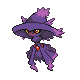

# Trainer Rosters

### Generic Trainers

| Trainer | P1 | P2 | P3 | P4 | P5 | P6 |
|:-------:|:--:|:--:|:--:|:--:|:--:|:--:|
|  Ace Trainer Megan |  [Jumpluff](../../pokemon/jumpluff.md/) Lv. 48 |  [Roserade](../../pokemon/roserade.md/) Lv. 48 |  [Venusaur](../../pokemon/venusaur.md/) Lv. 48 |  [Exeggutor](../../pokemon/exeggutor.md/) Lv. 48 |
|  Ace Trainer Blake |  [Magnezone](../../pokemon/magnezone.md/) Lv. 49 |  [Lanturn](../../pokemon/lanturn.md/) Lv. 49 |  [Alakazam](../../pokemon/alakazam.md/) Lv. 49 |
|  Ace Trainer Brian |  [Ninetales](../../pokemon/ninetales.md/) Lv. 48 |  [Mismagius](../../pokemon/mismagius.md/) Lv. 48 |  [Dusknoir](../../pokemon/dusknoir.md/) Lv. 48 |  [Weezing](../../pokemon/weezing.md/) Lv. 48 |
| ") Bird Keeper Jose [(!)](#rematches) |  [Farfetch'd](../../pokemon/farfetchd.md/) Lv. 48 |  [Chatot](../../pokemon/chatot.md/) Lv. 48 |
|  Psychic Eli |  [Gallade](../../pokemon/gallade.md/) Lv. 47 |  [Banette](../../pokemon/banette.md/) Lv. 47 |  [Girafarig](../../pokemon/girafarig.md/) Lv. 47 |
| ") Ace Trainer Reena [(!)](#rematches) |  [Hypno](../../pokemon/hypno.md/) Lv. 47 |  [Butterfree](../../pokemon/butterfree.md/) Lv. 47 |  [Vileplume](../../pokemon/vileplume.md/) Lv. 47 |  [Gastrodon](../../pokemon/gastrodon.md/) Lv. 47 |  [Forretress](../../pokemon/forretress.md/) Lv. 47 |

### Rematches

| Trainer | P1 | P2 | P3 | P4 | P5 | P6 |
|:-------:|:--:|:--:|:--:|:--:|:--:|:--:|
| ") Bird Keeper Jose (Sa8p-5a) |  [Farfetch'd](../../pokemon/farfetchd.md/) Lv. 44 |
| ") Bird Keeper Jose (Sa8p-5a) |  [Farfetch'd](../../pokemon/farfetchd.md/) Lv. 55 |  [Chatot](../../pokemon/chatot.md/) Lv. 55 |
| ") Bird Keeper Jose (Sa8p-5a) |  [Farfetch'd](../../pokemon/farfetchd.md/) Lv. 68 |  [Chatot](../../pokemon/chatot.md/) Lv. 68 |  [Altaria](../../pokemon/altaria.md/) Lv. 68 |
| ") Ace Trainer Reena (Su4a-10a) |  [Hypno](../../pokemon/hypno.md/) Lv. 49 |  [Butterfree](../../pokemon/butterfree.md/) Lv. 49 |  [Vileplume](../../pokemon/vileplume.md/) Lv. 49 |  [Gastrodon](../../pokemon/gastrodon.md/) Lv. 49 |  [Forretress](../../pokemon/forretress.md/) Lv. 49 |
| ") Ace Trainer Reena (Su4a-10a) |  [Hypno](../../pokemon/hypno.md/) Lv. 53 |  [Butterfree](../../pokemon/butterfree.md/) Lv. 53 |  [Vileplume](../../pokemon/vileplume.md/) Lv. 53 |  [Gastrodon](../../pokemon/gastrodon.md/) Lv. 53 |  [Forretress](../../pokemon/forretress.md/) Lv. 53 |
| ") Ace Trainer Reena (Su4a-10a) |  [Hypno](../../pokemon/hypno.md/) Lv. 68 |  [Butterfree](../../pokemon/butterfree.md/) Lv. 68 |  [Vileplume](../../pokemon/vileplume.md/) Lv. 68 |  [Gastrodon](../../pokemon/gastrodon.md/) Lv. 68 |  [Forretress](../../pokemon/forretress.md/) Lv. 68 |

