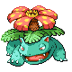

# Route 27 — Trainer Rosters

### Generic Trainers

| Trainer | P1 | P2 | P3 | P4 | P5 | P6 |
|:-------:|:--:|:--:|:--:|:--:|:--:|:--:|
|  Ace Trainer Megan |  Jumpluff Lv. 48 |  Roserade Lv. 48 |  Venusaur Lv. 48 |  Exeggutor Lv. 48 |
|  Ace Trainer Blake |  Magnezone Lv. 49 |  Lanturn Lv. 49 |  Alakazam Lv. 49 |
|  Ace Trainer Brian |  Ninetales Lv. 48 |  Mismagius Lv. 48 |  Dusknoir Lv. 48 |  Weezing Lv. 48 |
| ") Bird Keeper Jose [(!)](#rematches) |  Farfetch'd Lv. 48 |  Chatot Lv. 48 |
|  Psychic Eli |  Gallade Lv. 47 |  Banette Lv. 47 |  Girafarig Lv. 47 |
| ") Ace Trainer Reena [(!)](#rematches) |  Hypno Lv. 47 |  Butterfree Lv. 47 |  Vileplume Lv. 47 |  Gastrodon Lv. 47 |  Forretress Lv. 47 |

### Rematches

| Trainer | P1 | P2 | P3 | P4 | P5 | P6 |
|:-------:|:--:|:--:|:--:|:--:|:--:|:--:|
| ") Bird Keeper Jose (Sa8p-5a) |  Farfetch'd Lv. 44 |
| ") Bird Keeper Jose (Sa8p-5a) |  Farfetch'd Lv. 55 |  Chatot Lv. 55 |
| ") Bird Keeper Jose (Sa8p-5a) |  Farfetch'd Lv. 68 |  Chatot Lv. 68 |  Altaria Lv. 68 |
| ") Ace Trainer Reena (Su4a-10a) |  Hypno Lv. 49 |  Butterfree Lv. 49 |  Vileplume Lv. 49 |  Gastrodon Lv. 49 |  Forretress Lv. 49 |
| ") Ace Trainer Reena (Su4a-10a) |  Hypno Lv. 53 |  Butterfree Lv. 53 |  Vileplume Lv. 53 |  Gastrodon Lv. 53 |  Forretress Lv. 53 |
| ") Ace Trainer Reena (Su4a-10a) |  Hypno Lv. 68 |  Butterfree Lv. 68 |  Vileplume Lv. 68 |  Gastrodon Lv. 68 |  Forretress Lv. 68 |

