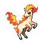

# Route 27 — Wild Pokémon

### Grass, Morning / Day

| Sprite | Pokémon | Encounter Type | Level | Chance |
|:------:|---------|:--------------:|-------|--------|
|  | [Doduo](../../pokemon/doduo.md) | encounter_sprites| 42 – 45 | 20% |
|  | [Skiploom](../../pokemon/skiploom.md) | encounter_sprites| 42 – 45 | 20% |
|  | [Ponyta](../../pokemon/ponyta.md) | encounter_sprites| 42 – 45 | 20% |
|  | [Dodrio](../../pokemon/dodrio.md) | encounter_sprites| 42 – 45 | 10% |
|  | [Rapidash](../../pokemon/rapidash.md) | encounter_sprites| 42 – 45 | 10% |
|  | [Sandslash](../../pokemon/sandslash.md) | encounter_sprites| 42 – 45 | 10% |
|  | [Arbok](../../pokemon/arbok.md) | encounter_sprites| 42 – 45 | 10% |

### Grass, Night

| Sprite | Pokémon | Encounter Type | Level | Chance |
|:------:|---------|:--------------:|-------|--------|
|  | [Wooper](../../pokemon/wooper.md) | encounter_sprites| 42 – 45 | 20% |
|  | [Houndour](../../pokemon/houndour.md) | encounter_sprites| 42 – 45 | 20% |
|  | [Ponyta](../../pokemon/ponyta.md) | encounter_sprites| 42 – 45 | 20% |
|  | [Quagsire](../../pokemon/quagsire.md) | encounter_sprites| 42 – 45 | 10% |
|  | [Rapidash](../../pokemon/rapidash.md) | encounter_sprites| 42 – 45 | 10% |
|  | [Sandslash](../../pokemon/sandslash.md) | encounter_sprites| 42 – 45 | 10% |
|  | [Arbok](../../pokemon/arbok.md) | encounter_sprites| 42 – 45 | 10% |

### Meridian Sound

| Sprite | Pokémon | Encounter Type | Level | Chance |
|:------:|---------|:--------------:|-------|--------|
|  | [Jumpluff](../../pokemon/jumpluff.md) | encounter_sprites| 42 – 45 | 100% |

### Pastoral Sound

| Sprite | Pokémon | Encounter Type | Level | Chance |
|:------:|---------|:--------------:|-------|--------|
|  | [Grumpig](../../pokemon/grumpig.md) | encounter_sprites| 42 – 45 | 100% |

### Swarm

| Sprite | Pokémon | Encounter Type | Level | Chance |
|:------:|---------|:--------------:|-------|--------|
|  | [Feebas](../../pokemon/feebas.md) | encounter_sprites| 42 – 45 | 100% |

### Surf

| Sprite | Pokémon | Encounter Type | Level | Chance |
|:------:|---------|:--------------:|-------|--------|
|  | [Buizel](../../pokemon/buizel.md) | encounter_sprites| 42 – 45 | 93% |
|  | [Floatzel](../../pokemon/floatzel.md) | encounter_sprites| 42 – 45 | 7% |

### Old Rod

| Sprite | Pokémon | Encounter Type | Level | Chance |
|:------:|---------|:--------------:|-------|--------|
|  | [Luvdisc](../../pokemon/luvdisc.md) | encounter_sprites| 10 | 100% |

### Good Rod

| Sprite | Pokémon | Encounter Type | Level | Chance |
|:------:|---------|:--------------:|-------|--------|
|  | [Luvdisc](../../pokemon/luvdisc.md) | encounter_sprites| 25 | 100% |

### Super Rod

| Sprite | Pokémon | Encounter Type | Level | Chance |
|:------:|---------|:--------------:|-------|--------|
|  | [Luvdisc](../../pokemon/luvdisc.md) | encounter_sprites| 50 | 100% |

