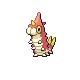

# Route 29 — Wild Pokémon

### Grass, Morning / Day

| Sprite | Pokémon | Encounter Type | Level | Chance |
|:------:|---------|:--------------:|-------|--------|
|  | Pidgey | {: style="max-width: 24px;"" } {: style="max-width: 24px;"" } {: style="max-width: 24px;"" } | 3 – 5 | 20% |
|  | Sentret | {: style="max-width: 24px;"" } {: style="max-width: 24px;"" } {: style="max-width: 24px;"" } | 3 – 5 | 20% |
|  | Starly | {: style="max-width: 24px;"" } {: style="max-width: 24px;"" } {: style="max-width: 24px;"" } | 3 – 5 | 15% |
|  | Rattata | {: style="max-width: 24px;"" } {: style="max-width: 24px;"" } {: style="max-width: 24px;"" } | 3 – 5 | 15% |
|  | Zigzagoon | {: style="max-width: 24px;"" } {: style="max-width: 24px;"" } {: style="max-width: 24px;"" } | 3 – 5 | 10% |
|  | Bidoof | {: style="max-width: 24px;"" } {: style="max-width: 24px;"" } {: style="max-width: 24px;"" } | 3 – 5 | 10% |
|  | Hoppip | {: style="max-width: 24px;"" } {: style="max-width: 24px;"" } {: style="max-width: 24px;"" } | 3 – 5 | 5% |
|  | Wurmple | {: style="max-width: 24px;"" } {: style="max-width: 24px;"" } {: style="max-width: 24px;"" } | 3 – 5 | 5% |

### Grass, Night

| Sprite | Pokémon | Encounter Type | Level | Chance |
|:------:|---------|:--------------:|-------|--------|
|  | Hoothoot | {: style="max-width: 24px;"" } {: style="max-width: 24px;"" } | 3 – 5 | 20% |
|  | Rattata | {: style="max-width: 24px;"" } {: style="max-width: 24px;"" } | 3 – 5 | 20% |
|  | Poochyena | {: style="max-width: 24px;"" } {: style="max-width: 24px;"" } | 3 – 5 | 15% |
|  | Zigzagoon | {: style="max-width: 24px;"" } {: style="max-width: 24px;"" } | 3 – 5 | 15% |
|  | Bidoof | {: style="max-width: 24px;"" } {: style="max-width: 24px;"" } | 3 – 5 | 15% |
|  | Wurmple | {: style="max-width: 24px;"" } {: style="max-width: 24px;"" } | 3 – 5 | 15% |

### Meridian Sound

| Sprite | Pokémon | Encounter Type | Level | Chance |
|:------:|---------|:--------------:|-------|--------|
|  | Furret | {: style="max-width: 24px;"" } | 3 – 5 | 50% |
|  | Raticate | {: style="max-width: 24px;"" } | 3 – 5 | 50% |

### Pastoral Sound

| Sprite | Pokémon | Encounter Type | Level | Chance |
|:------:|---------|:--------------:|-------|--------|
|  | Plusle | {: style="max-width: 24px;"" } | 3 – 5 | 50% |
|  | Minun | {: style="max-width: 24px;"" } | 3 – 5 | 50% |

