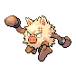

# Trainer Rosters

### Generic Trainers

| Trainer | P1 | P2 | P3 | P4 | P5 | P6 |
|:-------:|:--:|:--:|:--:|:--:|:--:|:--:|
|  Youngster Regis |  [Crobat](../../pokemon/crobat.md/) Lv. 57 |  [Electrode](../../pokemon/electrode.md/) Lv. 57 |
|  Youngster Warren |  [Wartortle](../../pokemon/wartortle.md/) Lv. 54 |  [Gligar](../../pokemon/gligar.md/) Lv. 54 |  [Noctowl](../../pokemon/noctowl.md/) Lv. 54 |
|  Youngster Jimmy |  [Cloyster](../../pokemon/cloyster.md/) Lv. 55 |  [Parasect](../../pokemon/parasect.md/) Lv. 55 |  [Raichu](../../pokemon/raichu.md/) Lv. 55 |
|  Double Team Zac & Jen |  [Poliwrath](../../pokemon/poliwrath.md/) Lv. 59 |  [Staraptor](../../pokemon/staraptor.md/) Lv. 59 |
|  Firebreather Otis |  [Infernape](../../pokemon/infernape.md/) Lv. 56 |  [Weezing](../../pokemon/weezing.md/) Lv. 56 |  [Camerupt](../../pokemon/camerupt.md/) Lv. 56 |
|  Hiker Bruce |  [Machoke](../../pokemon/machoke.md/) Lv. 56 |  [Hippowdon](../../pokemon/hippowdon.md/) Lv. 56 |  [Clefable](../../pokemon/clefable.md/) Lv. 56 |
|  Black Belt Manford |  [Medicham](../../pokemon/medicham.md/) Lv. 58 |
|  Black Belt Ander |  [Primeape](../../pokemon/primeape.md/) Lv. 57 |  [Vigoroth](../../pokemon/vigoroth.md/) Lv. 57 |  [Breloom](../../pokemon/breloom.md/) Lv. 57 |
|  Hiker Dwight |  [Magnezone](../../pokemon/magnezone.md/) Lv. 56 |  [Steelix](../../pokemon/steelix.md/) Lv. 56 |
|  Firebreather Burt |  [Weezing](../../pokemon/weezing.md/) Lv. 57 |  [Magcargo](../../pokemon/magcargo.md/) Lv. 57 |

