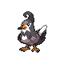
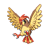
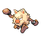
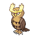
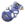
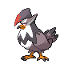
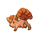

# Route 3 — Wild Pokémon

### Grass, Morning / Day

| Sprite | Pokémon | Encounter Type | Level | Chance |
|:------:|---------|:--------------:|-------|--------|
|  | Fearow | {: style="max-width: 24px;"" } {: style="max-width: 24px;"" } {: style="max-width: 24px;"" } | 46 – 49 | 20% |
|  | Staravia | {: style="max-width: 24px;"" } {: style="max-width: 24px;"" } {: style="max-width: 24px;"" } | 46 – 49 | 20% |
|  | Pidgeotto | {: style="max-width: 24px;"" } {: style="max-width: 24px;"" } {: style="max-width: 24px;"" } | 46 – 49 | 15% |
|  | Primeape | {: style="max-width: 24px;"" } {: style="max-width: 24px;"" } {: style="max-width: 24px;"" } | 46 – 49 | 15% |
|  | Nidorino | {: style="max-width: 24px;"" } {: style="max-width: 24px;"" } {: style="max-width: 24px;"" } | 46 – 49 | 15% |
|  | Nidorina | {: style="max-width: 24px;"" } {: style="max-width: 24px;"" } {: style="max-width: 24px;"" } | 46 – 49 | 15% |

### Grass, Night

| Sprite | Pokémon | Encounter Type | Level | Chance |
|:------:|---------|:--------------:|-------|--------|
|  | Fearow | {: style="max-width: 24px;"" } {: style="max-width: 24px;"" } | 46 – 49 | 20% |
|  | Jigglypuff | {: style="max-width: 24px;"" } {: style="max-width: 24px;"" } | 46 – 49 | 20% |
|  | Noctowl | {: style="max-width: 24px;"" } {: style="max-width: 24px;"" } | 46 – 49 | 15% |
|  | Primeape | {: style="max-width: 24px;"" } {: style="max-width: 24px;"" } | 46 – 49 | 15% |
|  | Nidorino | {: style="max-width: 24px;"" } {: style="max-width: 24px;"" } | 46 – 49 | 15% |
|  | Nidorina | {: style="max-width: 24px;"" } {: style="max-width: 24px;"" } | 46 – 49 | 15% |

### Swarm

| Sprite | Pokémon | Encounter Type | Level | Chance |
|:------:|---------|:--------------:|-------|--------|
|  | Spinda | {: style="max-width: 24px;"" } | 46 – 49 | 100% |

### Meridian Sound

| Sprite | Pokémon | Encounter Type | Level | Chance |
|:------:|---------|:--------------:|-------|--------|
|  | Wigglytuff | {: style="max-width: 24px;"" } | 46 – 49 | 50% |
|  | Staraptor | {: style="max-width: 24px;"" } | 46 – 49 | 50% |

### Pastoral Sound

| Sprite | Pokémon | Encounter Type | Level | Chance |
|:------:|---------|:--------------:|-------|--------|
|  | Growlithe | {: style="max-width: 24px;"" } | 46 – 49 | 50% |
|  | Vulpix | {: style="max-width: 24px;"" } | 46 – 49 | 50% |

