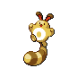
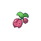

# Route 30 — Trainer Rosters

### Generic Trainers

| Trainer | P1 | P2 | P3 | P4 | P5 | P6 |
|:-------:|:--:|:--:|:--:|:--:|:--:|:--:|
| ") Youngster Joey [(!)](#rematches) |  Rattata Lv. 7 |
|  Aroma Lady Julia |  Budew Lv. 6 |  Sentret Lv. 6 |  Seedot Lv. 6 |  Cherubi Lv. 6 |
|  Idol Carly |  Jigglypuff Lv. 6 |  Clefairy Lv. 6 |  Skitty Lv. 6 |

### Rematches

| Trainer | P1 | P2 | P3 | P4 | P5 | P6 |
|:-------:|:--:|:--:|:--:|:--:|:--:|:--:|
| ") Youngster Joey (M10a-8p) |  Raticate Lv. 48 |
| ") Youngster Joey (M10a-8p) |  Raticate Lv. 56 |
| ") Youngster Joey (M10a-8p) |  Raticate Lv. 72 |

