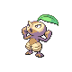

# Route 30 — Wild Pokémon

### Grass, Morning

| Sprite | Pokémon | Encounter Type | Level | Chance |
|:------:|---------|:--------------:|-------|--------|
|  | Ledyba | {: style="max-width: 24px;"" } {: style="max-width: 24px;"" } | 4 – 6 | 20% |
|  | Taillow | {: style="max-width: 24px;"" } {: style="max-width: 24px;"" } | 4 – 6 | 20% |
|  | Lotad | {: style="max-width: 24px;"" } {: style="max-width: 24px;"" } | 4 – 6 | 10% |
|  | Seedot | {: style="max-width: 24px;"" } {: style="max-width: 24px;"" } | 4 – 6 | 10% |
|  | Caterpie | {: style="max-width: 24px;"" } {: style="max-width: 24px;"" } | 4 – 6 | 10% |
|  | Weedle | {: style="max-width: 24px;"" } {: style="max-width: 24px;"" } | 4 – 6 | 10% |
|  | Kricketot | {: style="max-width: 24px;"" } {: style="max-width: 24px;"" } | 4 – 6 | 10% |
|  | Surskit | {: style="max-width: 24px;"" } {: style="max-width: 24px;"" } | 4 – 6 | 5% |
|  | Ralts | {: style="max-width: 24px;"" } {: style="max-width: 24px;"" } | 4 – 6 | 5% |

### Grass, Day

| Sprite | Pokémon | Encounter Type | Level | Chance |
|:------:|---------|:--------------:|-------|--------|
|  | Caterpie | {: style="max-width: 24px;"" } {: style="max-width: 24px;"" } | 4 – 6 | 20% |
|  | Weedle | {: style="max-width: 24px;"" } {: style="max-width: 24px;"" } | 4 – 6 | 20% |
|  | Lotad | {: style="max-width: 24px;"" } {: style="max-width: 24px;"" } | 4 – 6 | 10% |
|  | Seedot | {: style="max-width: 24px;"" } {: style="max-width: 24px;"" } | 4 – 6 | 10% |
|  | Taillow | {: style="max-width: 24px;"" } {: style="max-width: 24px;"" } | 4 – 6 | 10% |
|  | Metapod | {: style="max-width: 24px;"" } {: style="max-width: 24px;"" } | 4 – 6 | 10% |
|  | Kakuna | {: style="max-width: 24px;"" } {: style="max-width: 24px;"" } | 4 – 6 | 10% |
|  | Surskit | {: style="max-width: 24px;"" } {: style="max-width: 24px;"" } | 4 – 6 | 5% |
|  | Ralts | {: style="max-width: 24px;"" } {: style="max-width: 24px;"" } | 4 – 6 | 5% |

### Grass, Night

| Sprite | Pokémon | Encounter Type | Level | Chance |
|:------:|---------|:--------------:|-------|--------|
|  | Spinarak | {: style="max-width: 24px;"" } {: style="max-width: 24px;"" } | 4 – 6 | 20% |
|  | Hoothoot | {: style="max-width: 24px;"" } {: style="max-width: 24px;"" } | 4 – 6 | 20% |
|  | Lotad | {: style="max-width: 24px;"" } {: style="max-width: 24px;"" } | 4 – 6 | 10% |
|  | Seedot | {: style="max-width: 24px;"" } {: style="max-width: 24px;"" } | 4 – 6 | 10% |
|  | Caterpie | {: style="max-width: 24px;"" } {: style="max-width: 24px;"" } | 4 – 6 | 10% |
|  | Weedle | {: style="max-width: 24px;"" } {: style="max-width: 24px;"" } | 4 – 6 | 10% |
|  | Kricketot | {: style="max-width: 24px;"" } {: style="max-width: 24px;"" } | 4 – 6 | 10% |
|  | Surskit | {: style="max-width: 24px;"" } {: style="max-width: 24px;"" } | 4 – 6 | 5% |
|  | Ralts | {: style="max-width: 24px;"" } {: style="max-width: 24px;"" } | 4 – 6 | 5% |

### Meridian Sound

| Sprite | Pokémon | Encounter Type | Level | Chance |
|:------:|---------|:--------------:|-------|--------|
|  | Lombre | {: style="max-width: 24px;"" } | 4 – 6 | 50% |
|  | Nuzleaf | {: style="max-width: 24px;"" } | 4 – 6 | 50% |

### Pastoral Sound

| Sprite | Pokémon | Encounter Type | Level | Chance |
|:------:|---------|:--------------:|-------|--------|
|  | Ralts | {: style="max-width: 24px;"" } | 4 – 6 | 100% |

### Surf

| Sprite | Pokémon | Encounter Type | Level | Chance |
|:------:|---------|:--------------:|-------|--------|
|  | Poliwag | {: style="max-width: 24px;"" } | 4 – 6 | 60% |
|  | Lotad | {: style="max-width: 24px;"" } | 4 – 6 | 30% |
|  | Poliwhirl | {: style="max-width: 24px;"" } | 4 – 6 | 5% |
|  | Lombre | {: style="max-width: 24px;"" } | 4 – 6 | 5% |

### Old Rod

| Sprite | Pokémon | Encounter Type | Level | Chance |
|:------:|---------|:--------------:|-------|--------|
|  | Poliwag | {: style="max-width: 24px;"" } | 10 | 60% |
|  | Goldeen | {: style="max-width: 24px;"" } | 10 | 30% |
|  | Psyduck | {: style="max-width: 24px;"" } | 10 | 10% |

### Good Rod

| Sprite | Pokémon | Encounter Type | Level | Chance |
|:------:|---------|:--------------:|-------|--------|
|  | Psyduck | {: style="max-width: 24px;"" } | 25 | 60% |
|  | Goldeen | {: style="max-width: 24px;"" } | 25 | 30% |
|  | Poliwhirl | {: style="max-width: 24px;"" } | 25 | 10% |

### Super Rod

| Sprite | Pokémon | Encounter Type | Level | Chance |
|:------:|---------|:--------------:|-------|--------|
|  | Poliwhirl | {: style="max-width: 24px;"" } | 50 | 60% |
|  | Seaking | {: style="max-width: 24px;"" } | 50 | 30% |
|  | Golduck | {: style="max-width: 24px;"" } | 50 | 10% |

