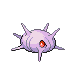

# Route 31 — Wild Pokémon

### Grass, Morning

| Sprite | Pokémon | Encounter Type | Level | Chance |
|:------:|---------|:--------------:|-------|--------|
|  | [Ledyba](../../pokemon/ledyba.md) | encounter_sprites| 6 – 10 | 20% |
|  | [Bellsprout](../../pokemon/bellsprout.md) | encounter_sprites| 6 – 10 | 20% |
|  | [Buizel](../../pokemon/buizel.md) | encounter_sprites| 6 – 10 | 10% |
|  | [Shinx](../../pokemon/shinx.md) | encounter_sprites| 6 – 10 | 10% |
|  | [Abra](../../pokemon/abra.md) | encounter_sprites| 6 – 10 | 10% |
|  | [Natu](../../pokemon/natu.md) | encounter_sprites| 6 – 10 | 10% |
|  | [Exeggcute](../../pokemon/exeggcute.md) | encounter_sprites| 6 – 10 | 5% |
|  | [Psyduck](../../pokemon/psyduck.md) | encounter_sprites| 6 – 10 | 5% |
|  | [Metapod](../../pokemon/metapod.md) | encounter_sprites| 6 – 10 | 4% |
|  | [Kakuna](../../pokemon/kakuna.md) | encounter_sprites| 6 – 10 | 4% |
|  | [Butterfree](../../pokemon/butterfree.md) | encounter_sprites| 6 – 10 | 1% |
|  | [Beedrill](../../pokemon/beedrill.md) | encounter_sprites| 6 – 10 | 1% |

### Grass, Day

| Sprite | Pokémon | Encounter Type | Level | Chance |
|:------:|---------|:--------------:|-------|--------|
|  | [Wurmple](../../pokemon/wurmple.md) | encounter_sprites| 6 – 10 | 20% |
|  | [Bellsprout](../../pokemon/bellsprout.md) | encounter_sprites| 6 – 10 | 20% |
|  | [Buizel](../../pokemon/buizel.md) | encounter_sprites| 6 – 10 | 10% |
|  | [Shinx](../../pokemon/shinx.md) | encounter_sprites| 6 – 10 | 10% |
|  | [Abra](../../pokemon/abra.md) | encounter_sprites| 6 – 10 | 10% |
|  | [Natu](../../pokemon/natu.md) | encounter_sprites| 6 – 10 | 10% |
|  | [Budew](../../pokemon/budew.md) | encounter_sprites| 6 – 10 | 5% |
|  | [Psyduck](../../pokemon/psyduck.md) | encounter_sprites| 6 – 10 | 5% |
|  | [Silcoon](../../pokemon/silcoon.md) | encounter_sprites| 6 – 10 | 4% |
|  | [Cascoon](../../pokemon/cascoon.md) | encounter_sprites| 6 – 10 | 4% |
|  | [Exeggcute](../../pokemon/exeggcute.md) | encounter_sprites| 6 – 10 | 2% |

### Grass, Night

| Sprite | Pokémon | Encounter Type | Level | Chance |
|:------:|---------|:--------------:|-------|--------|
|  | [Spinarak](../../pokemon/spinarak.md) | encounter_sprites| 6 – 10 | 20% |
|  | [Bellsprout](../../pokemon/bellsprout.md) | encounter_sprites| 6 – 10 | 20% |
|  | [Psyduck](../../pokemon/psyduck.md) | encounter_sprites| 6 – 10 | 10% |
|  | [Shinx](../../pokemon/shinx.md) | encounter_sprites| 6 – 10 | 10% |
|  | [Abra](../../pokemon/abra.md) | encounter_sprites| 6 – 10 | 10% |
|  | [Natu](../../pokemon/natu.md) | encounter_sprites| 6 – 10 | 10% |
|  | [Exeggcute](../../pokemon/exeggcute.md) | encounter_sprites| 6 – 10 | 5% |
|  | [Buizel](../../pokemon/buizel.md) | encounter_sprites| 6 – 10 | 5% |
|  | [Metapod](../../pokemon/metapod.md) | encounter_sprites| 6 – 10 | 4% |
|  | [Kakuna](../../pokemon/kakuna.md) | encounter_sprites| 6 – 10 | 4% |
|  | [Beautifly](../../pokemon/beautifly.md) | encounter_sprites| 6 – 10 | 1% |
|  | [Dustox](../../pokemon/dustox.md) | encounter_sprites| 6 – 10 | 1% |

### Meridian Sound

| Sprite | Pokémon | Encounter Type | Level | Chance |
|:------:|---------|:--------------:|-------|--------|
|  | [Butterfree](../../pokemon/butterfree.md) | encounter_sprites| 6 – 10 | 50% |
|  | [Beedrill](../../pokemon/beedrill.md) | encounter_sprites| 6 – 10 | 50% |

### Pastoral Sound

| Sprite | Pokémon | Encounter Type | Level | Chance |
|:------:|---------|:--------------:|-------|--------|
|  | [Budew](../../pokemon/budew.md) | encounter_sprites| 6 – 10 | 100% |

### Surf

| Sprite | Pokémon | Encounter Type | Level | Chance |
|:------:|---------|:--------------:|-------|--------|
|  | [Marill](../../pokemon/marill.md) | encounter_sprites| 6 – 10 | 60% |
|  | [Surskit](../../pokemon/surskit.md) | encounter_sprites| 6 – 10 | 35% |
|  | [Masquerain](../../pokemon/masquerain.md) | encounter_sprites| 6 – 10 | 5% |

### Old Rod

| Sprite | Pokémon | Encounter Type | Level | Chance |
|:------:|---------|:--------------:|-------|--------|
|  | [Tentacool](../../pokemon/tentacool.md) | encounter_sprites| 10 | 60% |
|  | [Slowpoke](../../pokemon/slowpoke.md) | encounter_sprites| 10 | 35% |
|  | [Feebas](../../pokemon/feebas.md) | encounter_sprites| 10 | 5% |

### Good Rod

| Sprite | Pokémon | Encounter Type | Level | Chance |
|:------:|---------|:--------------:|-------|--------|
|  | [Tentacool](../../pokemon/tentacool.md) | encounter_sprites| 25 | 60% |
|  | [Slowpoke](../../pokemon/slowpoke.md) | encounter_sprites| 25 | 30% |
|  | [Feebas](../../pokemon/feebas.md) | encounter_sprites| 25 | 10% |

### Super Rod

| Sprite | Pokémon | Encounter Type | Level | Chance |
|:------:|---------|:--------------:|-------|--------|
|  | [Tentacruel](../../pokemon/tentacruel.md) | encounter_sprites| 50 | 60% |
|  | [Feebas](../../pokemon/feebas.md) | encounter_sprites| 50 | 30% |
|  | [Slowbro](../../pokemon/slowbro.md) | encounter_sprites| 50 | 10% |

