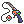

# Route 31 Wild Pokémon

### Grass, Morning

| Sprite | Pokémon | Encounter Type | Level | Chance |
|:------:|---------|:--------------:|-------|--------|
|  | Ledyba | {: style="max-width: 24px;"" } {: style="max-width: 24px;"" } | 6 – 10 | 20% |
|  | Bellsprout | {: style="max-width: 24px;"" } {: style="max-width: 24px;"" } | 6 – 10 | 20% |
|  | Buizel | {: style="max-width: 24px;"" } {: style="max-width: 24px;"" } | 6 – 10 | 10% |
|  | Shinx | {: style="max-width: 24px;"" } {: style="max-width: 24px;"" } | 6 – 10 | 10% |
|  | Abra | {: style="max-width: 24px;"" } {: style="max-width: 24px;"" } | 6 – 10 | 10% |
|  | Natu | {: style="max-width: 24px;"" } {: style="max-width: 24px;"" } | 6 – 10 | 10% |
|  | Exeggcute | {: style="max-width: 24px;"" } {: style="max-width: 24px;"" } | 6 – 10 | 5% |
|  | Psyduck | {: style="max-width: 24px;"" } {: style="max-width: 24px;"" } | 6 – 10 | 5% |
|  | Metapod | {: style="max-width: 24px;"" } {: style="max-width: 24px;"" } | 6 – 10 | 4% |
|  | Kakuna | {: style="max-width: 24px;"" } {: style="max-width: 24px;"" } | 6 – 10 | 4% |
|  | Butterfree | {: style="max-width: 24px;"" } {: style="max-width: 24px;"" } | 6 – 10 | 1% |
|  | Beedrill | {: style="max-width: 24px;"" } {: style="max-width: 24px;"" } | 6 – 10 | 1% |

### Grass, Day

| Sprite | Pokémon | Encounter Type | Level | Chance |
|:------:|---------|:--------------:|-------|--------|
|  | Wurmple | {: style="max-width: 24px;"" } {: style="max-width: 24px;"" } | 6 – 10 | 20% |
|  | Bellsprout | {: style="max-width: 24px;"" } {: style="max-width: 24px;"" } | 6 – 10 | 20% |
|  | Buizel | {: style="max-width: 24px;"" } {: style="max-width: 24px;"" } | 6 – 10 | 10% |
|  | Shinx | {: style="max-width: 24px;"" } {: style="max-width: 24px;"" } | 6 – 10 | 10% |
|  | Abra | {: style="max-width: 24px;"" } {: style="max-width: 24px;"" } | 6 – 10 | 10% |
|  | Natu | {: style="max-width: 24px;"" } {: style="max-width: 24px;"" } | 6 – 10 | 10% |
|  | Budew | {: style="max-width: 24px;"" } {: style="max-width: 24px;"" } | 6 – 10 | 5% |
|  | Psyduck | {: style="max-width: 24px;"" } {: style="max-width: 24px;"" } | 6 – 10 | 5% |
|  | Silcoon | {: style="max-width: 24px;"" } {: style="max-width: 24px;"" } | 6 – 10 | 4% |
|  | Cascoon | {: style="max-width: 24px;"" } {: style="max-width: 24px;"" } | 6 – 10 | 4% |
|  | Exeggcute | {: style="max-width: 24px;"" } {: style="max-width: 24px;"" } | 6 – 10 | 2% |

### Grass, Night

| Sprite | Pokémon | Encounter Type | Level | Chance |
|:------:|---------|:--------------:|-------|--------|
|  | Spinarak | {: style="max-width: 24px;"" } {: style="max-width: 24px;"" } | 6 – 10 | 20% |
|  | Bellsprout | {: style="max-width: 24px;"" } {: style="max-width: 24px;"" } | 6 – 10 | 20% |
|  | Psyduck | {: style="max-width: 24px;"" } {: style="max-width: 24px;"" } | 6 – 10 | 10% |
|  | Shinx | {: style="max-width: 24px;"" } {: style="max-width: 24px;"" } | 6 – 10 | 10% |
|  | Abra | {: style="max-width: 24px;"" } {: style="max-width: 24px;"" } | 6 – 10 | 10% |
|  | Natu | {: style="max-width: 24px;"" } {: style="max-width: 24px;"" } | 6 – 10 | 10% |
|  | Exeggcute | {: style="max-width: 24px;"" } {: style="max-width: 24px;"" } | 6 – 10 | 5% |
|  | Buizel | {: style="max-width: 24px;"" } {: style="max-width: 24px;"" } | 6 – 10 | 5% |
|  | Metapod | {: style="max-width: 24px;"" } {: style="max-width: 24px;"" } | 6 – 10 | 4% |
|  | Kakuna | {: style="max-width: 24px;"" } {: style="max-width: 24px;"" } | 6 – 10 | 4% |
|  | Beautifly | {: style="max-width: 24px;"" } {: style="max-width: 24px;"" } | 6 – 10 | 1% |
|  | Dustox | {: style="max-width: 24px;"" } {: style="max-width: 24px;"" } | 6 – 10 | 1% |

### Meridian Sound

| Sprite | Pokémon | Encounter Type | Level | Chance |
|:------:|---------|:--------------:|-------|--------|
|  | Butterfree | {: style="max-width: 24px;"" } | 6 – 10 | 50% |
|  | Beedrill | {: style="max-width: 24px;"" } | 6 – 10 | 50% |

### Pastoral Sound

| Sprite | Pokémon | Encounter Type | Level | Chance |
|:------:|---------|:--------------:|-------|--------|
|  | Budew | {: style="max-width: 24px;"" } | 6 – 10 | 100% |

### Surf

| Sprite | Pokémon | Encounter Type | Level | Chance |
|:------:|---------|:--------------:|-------|--------|
|  | Marill | {: style="max-width: 24px;"" } | 6 – 10 | 60% |
|  | Surskit | {: style="max-width: 24px;"" } | 6 – 10 | 35% |
|  | Masquerain | {: style="max-width: 24px;"" } | 6 – 10 | 5% |

### Old Rod

| Sprite | Pokémon | Encounter Type | Level | Chance |
|:------:|---------|:--------------:|-------|--------|
|  | Tentacool | {: style="max-width: 24px;"" } | 10 | 60% |
|  | Slowpoke | {: style="max-width: 24px;"" } | 10 | 35% |
|  | Feebas | {: style="max-width: 24px;"" } | 10 | 5% |

### Good Rod

| Sprite | Pokémon | Encounter Type | Level | Chance |
|:------:|---------|:--------------:|-------|--------|
|  | Tentacool | {: style="max-width: 24px;"" } | 25 | 60% |
|  | Slowpoke | {: style="max-width: 24px;"" } | 25 | 30% |
|  | Feebas | {: style="max-width: 24px;"" } | 25 | 10% |

### Super Rod

| Sprite | Pokémon | Encounter Type | Level | Chance |
|:------:|---------|:--------------:|-------|--------|
|  | Tentacruel | {: style="max-width: 24px;"" } | 50 | 60% |
|  | Feebas | {: style="max-width: 24px;"" } | 50 | 30% |
|  | Slowbro | {: style="max-width: 24px;"" } | 50 | 10% |

