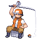
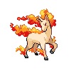
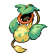

# Route 32 — Trainer Rosters

### Generic Trainers

| Trainer | P1 | P2 | P3 | P4 | P5 | P6 |
|:-------:|:--:|:--:|:--:|:--:|:--:|:--:|
|  Parasol Lady Joan |  Mareep Lv. 14 |  Drifloon Lv. 14 |
|  Ruin Maniac Gordon |  Sandshrew Lv. 14 |  Onix Lv. 14 |
| ") Picnicker Liz [(!)](#rematches) |  Nidoran F Lv. 14 |  Ponyta Lv. 14 |
|  Fisherman Henry |  Poliwag Lv. 14 |  Remoraid Lv. 14 |  Goldeen Lv. 14 |
|  Fisherman Justin |  Magikarp Lv. 10 |  Magikarp Lv. 10 |  Magikarp Lv. 15 |  Feebas Lv. 15 |
| ") Fisherman Ralph [(!)](#rematches) |  Goldeen Lv. 14 |  Qwilfish Lv. 14 |
|  Camper Roland |  Nidoran M Lv. 14 |  Diglett Lv. 14 |  Pikachu Lv. 14 |
|  Ace Trainer Peter |  Staravia Lv. 14 |  Oddish Lv. 14 |  Elekid Lv. 14 |  Nidorino Lv. 16 |

### Rematches

| Trainer | P1 | P2 | P3 | P4 | P5 | P6 |
|:-------:|:--:|:--:|:--:|:--:|:--:|:--:|
| ") Picnicker Liz (Th10a-8p) |  Rapidash Lv. 47 |  Nidoqueen Lv. 47 |
| ") Picnicker Liz (Th10a-8p) |  Victreebel Lv. 53 |  Rapidash Lv. 53 |  Nidoqueen Lv. 53 |
| ") Picnicker Liz (Th10a-8p) |  Victreebel Lv. 68 |  Rapidash Lv. 68 |  Nidoqueen Lv. 68 |
| ") Fisherman Ralph (W4a-10a) |  Seaking Lv. 46 |  Qwilfish Lv. 46 |
| ") Fisherman Ralph (W4a-10a) |  Qwilfish Lv. 53 |  Seaking Lv. 53 |
| ") Fisherman Ralph (W4a-10a) |  Qwilfish Lv. 69 |  Seaking Lv. 69 |

