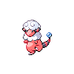

# Route 32 — Wild Pokémon

### Grass, Morning / Day

| Sprite | Pokémon | Encounter Type | Level | Chance |
|:------:|---------|:--------------:|-------|--------|
|  | Mareep | {: style="max-width: 24px;"" } {: style="max-width: 24px;"" } {: style="max-width: 24px;"" } | 10 – 12 | 20% |
|  | Bellsprout | {: style="max-width: 24px;"" } {: style="max-width: 24px;"" } {: style="max-width: 24px;"" } | 10 – 12 | 20% |
|  | Nincada | {: style="max-width: 24px;"" } {: style="max-width: 24px;"" } {: style="max-width: 24px;"" } | 10 – 12 | 15% |
|  | Hoppip | {: style="max-width: 24px;"" } {: style="max-width: 24px;"" } {: style="max-width: 24px;"" } | 10 – 12 | 15% |
|  | Magnemite | {: style="max-width: 24px;"" } {: style="max-width: 24px;"" } {: style="max-width: 24px;"" } | 10 – 12 | 15% |
|  | Ekans | {: style="max-width: 24px;"" } {: style="max-width: 24px;"" } {: style="max-width: 24px;"" } | 10 – 12 | 10% |
|  | Pachirisu | {: style="max-width: 24px;"" } {: style="max-width: 24px;"" } {: style="max-width: 24px;"" } | 10 – 12 | 5% |

### Grass, Night

| Sprite | Pokémon | Encounter Type | Level | Chance |
|:------:|---------|:--------------:|-------|--------|
|  | Mareep | {: style="max-width: 24px;"" } {: style="max-width: 24px;"" } | 10 – 12 | 20% |
|  | Bellsprout | {: style="max-width: 24px;"" } {: style="max-width: 24px;"" } | 10 – 12 | 20% |
|  | Nincada | {: style="max-width: 24px;"" } {: style="max-width: 24px;"" } | 10 – 12 | 15% |
|  | Wooper | {: style="max-width: 24px;"" } {: style="max-width: 24px;"" } | 10 – 12 | 15% |
|  | Magnemite | {: style="max-width: 24px;"" } {: style="max-width: 24px;"" } | 10 – 12 | 15% |
|  | Ekans | {: style="max-width: 24px;"" } {: style="max-width: 24px;"" } | 10 – 12 | 10% |
|  | Drifloon | {: style="max-width: 24px;"" } {: style="max-width: 24px;"" } | 10 – 12 | 5% |

### Meridian Sound

| Sprite | Pokémon | Encounter Type | Level | Chance |
|:------:|---------|:--------------:|-------|--------|
|  | Flaaffy | {: style="max-width: 24px;"" } | 10 – 12 | 50% |
|  | Magneton | {: style="max-width: 24px;"" } | 10 – 12 | 50% |

### Pastoral Sound

| Sprite | Pokémon | Encounter Type | Level | Chance |
|:------:|---------|:--------------:|-------|--------|
|  | Drifloon | {: style="max-width: 24px;"" } | 10 – 12 | 50% |
|  | Pachirisu | {: style="max-width: 24px;"" } | 10 – 12 | 50% |

### Surf

| Sprite | Pokémon | Encounter Type | Level | Chance |
|:------:|---------|:--------------:|-------|--------|
|  | Wooper | {: style="max-width: 24px;"" } | 10 – 12 | 60% |
|  | Tentacool | {: style="max-width: 24px;"" } | 10 – 12 | 30% |
|  | Quagsire | {: style="max-width: 24px;"" } | 10 – 12 | 5% |
|  | Tentacruel | {: style="max-width: 24px;"" } | 10 – 12 | 5% |

### Old Rod

| Sprite | Pokémon | Encounter Type | Level | Chance |
|:------:|---------|:--------------:|-------|--------|
|  | Tentacool | {: style="max-width: 24px;"" } | 10 | 60% |
|  | Psyduck | {: style="max-width: 24px;"" } | 10 | 35% |
|  | Qwilfish | {: style="max-width: 24px;"" } | 10 | 5% |

### Good Rod

| Sprite | Pokémon | Encounter Type | Level | Chance |
|:------:|---------|:--------------:|-------|--------|
|  | Tentacool | {: style="max-width: 24px;"" } | 25 | 60% |
|  | Psyduck | {: style="max-width: 24px;"" } | 25 | 30% |
|  | Qwilfish | {: style="max-width: 24px;"" } | 25 | 10% |

### Super Rod

| Sprite | Pokémon | Encounter Type | Level | Chance |
|:------:|---------|:--------------:|-------|--------|
|  | Qwilfish | {: style="max-width: 24px;"" } | 50 | 60% |
|  | Tentacruel | {: style="max-width: 24px;"" } | 50 | 30% |
|  | Golduck | {: style="max-width: 24px;"" } | 50 | 10% |

