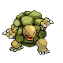

# Route 33 — Trainer Rosters

### Generic Trainers

| Trainer | P1 | P2 | P3 | P4 | P5 | P6 |
|:-------:|:--:|:--:|:--:|:--:|:--:|:--:|
| ") Hiker Anthony [(!)](#rematches) |  Geodude Lv. 16 |  Machop Lv. 16 |

### Rematches

| Trainer | P1 | P2 | P3 | P4 | P5 | P6 |
|:-------:|:--:|:--:|:--:|:--:|:--:|:--:|
| ") Hiker Anthony (F8p-5a) |  Graveler Lv. 46 |  Machoke Lv. 46 |
| ") Hiker Anthony (F8p-5a) |  Golem Lv. 52 |  Machamp Lv. 52 |  Nosepass Lv. 52 |
| ") Hiker Anthony (F8p-5a) |  Golem Lv. 68 |  Machamp Lv. 68 |  Probopass Lv. 68 |

