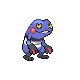

# Route 33 — Wild Pokémon

### Grass, Morning / Day

| Sprite | Pokémon | Encounter Type | Level | Chance |
|:------:|---------|:--------------:|-------|--------|
|  | Croagunk | {: style="max-width: 24px;"" } {: style="max-width: 24px;"" } {: style="max-width: 24px;"" } | 14 – 16 | 20% |
|  | Ekans | {: style="max-width: 24px;"" } {: style="max-width: 24px;"" } {: style="max-width: 24px;"" } | 14 – 16 | 20% |
|  | Skorupi | {: style="max-width: 24px;"" } {: style="max-width: 24px;"" } {: style="max-width: 24px;"" } | 14 – 16 | 10% |
|  | Slakoth | {: style="max-width: 24px;"" } {: style="max-width: 24px;"" } {: style="max-width: 24px;"" } | 14 – 16 | 10% |
|  | Swablu | {: style="max-width: 24px;"" } {: style="max-width: 24px;"" } {: style="max-width: 24px;"" } | 14 – 16 | 10% |
|  | Aipom | {: style="max-width: 24px;"" } {: style="max-width: 24px;"" } {: style="max-width: 24px;"" } | 14 – 16 | 10% |
|  | Hoppip | {: style="max-width: 24px;"" } {: style="max-width: 24px;"" } {: style="max-width: 24px;"" } | 14 – 16 | 10% |
|  | Rhyhorn | {: style="max-width: 24px;"" } {: style="max-width: 24px;"" } {: style="max-width: 24px;"" } | 14 – 16 | 10% |

### Grass, Night

| Sprite | Pokémon | Encounter Type | Level | Chance |
|:------:|---------|:--------------:|-------|--------|
|  | Croagunk | {: style="max-width: 24px;"" } {: style="max-width: 24px;"" } | 14 – 16 | 20% |
|  | Ekans | {: style="max-width: 24px;"" } {: style="max-width: 24px;"" } | 14 – 16 | 20% |
|  | Skorupi | {: style="max-width: 24px;"" } {: style="max-width: 24px;"" } | 14 – 16 | 10% |
|  | Slakoth | {: style="max-width: 24px;"" } {: style="max-width: 24px;"" } | 14 – 16 | 10% |
|  | Swablu | {: style="max-width: 24px;"" } {: style="max-width: 24px;"" } | 14 – 16 | 10% |
|  | Aipom | {: style="max-width: 24px;"" } {: style="max-width: 24px;"" } | 14 – 16 | 10% |
|  | Meowth | {: style="max-width: 24px;"" } {: style="max-width: 24px;"" } | 14 – 16 | 10% |
|  | Rhyhorn | {: style="max-width: 24px;"" } {: style="max-width: 24px;"" } | 14 – 16 | 10% |

### Meridian Sound

| Sprite | Pokémon | Encounter Type | Level | Chance |
|:------:|---------|:--------------:|-------|--------|
|  | Toxicroak | {: style="max-width: 24px;"" } | 14 – 16 | 50% |
|  | Drapion | {: style="max-width: 24px;"" } | 14 – 16 | 50% |

### Pastoral Sound

| Sprite | Pokémon | Encounter Type | Level | Chance |
|:------:|---------|:--------------:|-------|--------|
|  | Lombre | {: style="max-width: 24px;"" } | 14 – 16 | 100% |

