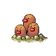

# Route 34 — Trainer Rosters

### Generic Trainers

| Trainer | P1 | P2 | P3 | P4 | P5 | P6 |
|:-------:|:--:|:--:|:--:|:--:|:--:|:--:|
|  Gentleman Samuel |  [Electrike](../../pokemon/electrike.md/) Lv. 20 |  [Cranidos](../../pokemon/cranidos.md/) Lv. 20 |
|  Socialite Brandon |  [Snubbull](../../pokemon/snubbull.md/) Lv. 20 |  [Spoink](../../pokemon/spoink.md/) Lv. 20 |
| ") Picnicker Gina [(!)](#rematches) |  [Hoppip](../../pokemon/hoppip.md/) Lv. 18 |  [Skiploom](../../pokemon/skiploom.md/) Lv. 19 |  [Ivysaur](../../pokemon/ivysaur.md/) Lv. 20 |
| ") Youngster Ian [(!)](#rematches) |  [Mankey](../../pokemon/mankey.md/) Lv. 19 |  [Bonsly](../../pokemon/bonsly.md/) Lv. 19 |  [Nidorino](../../pokemon/nidorino.md/) Lv. 19 |
|  Policeman Keith |  [Growlithe](../../pokemon/growlithe.md/) Lv. 20 |
| ") Camper Todd [(!)](#rematches) |  [Buizel](../../pokemon/buizel.md/) Lv. 20 |

### Rematches

| Trainer | P1 | P2 | P3 | P4 | P5 | P6 |
|:-------:|:--:|:--:|:--:|:--:|:--:|:--:|
| ") Picnicker Gina (Su10a-8p) |  [Skiploom](../../pokemon/skiploom.md/) Lv. 47 |  [Venusaur](../../pokemon/venusaur.md/) Lv. 47 |  [Jumpluff](../../pokemon/jumpluff.md/) Lv. 47 |
| ") Picnicker Gina (Su10a-8p) |  [Jumpluff](../../pokemon/jumpluff.md/) Lv. 53 |  [Jumpluff](../../pokemon/jumpluff.md/) Lv. 53 |  [Venusaur](../../pokemon/venusaur.md/) Lv. 53 |
| ") Picnicker Gina (Su10a-8p) |  [Jumpluff](../../pokemon/jumpluff.md/) Lv. 68 |  [Jumpluff](../../pokemon/jumpluff.md/) Lv. 68 |  [Venusaur](../../pokemon/venusaur.md/) Lv. 68 |
| ") Youngster Ian (Sa4a-10a) |  [Primeape](../../pokemon/primeape.md/) Lv. 46 |  [Sudowoodo](../../pokemon/sudowoodo.md/) Lv. 46 |  [Nidoking](../../pokemon/nidoking.md/) Lv. 46 |
| ") Youngster Ian (Sa4a-10a) |  [Primeape](../../pokemon/primeape.md/) Lv. 52 |  [Sudowoodo](../../pokemon/sudowoodo.md/) Lv. 52 |  [Nidoking](../../pokemon/nidoking.md/) Lv. 54 |
| ") Youngster Ian (Sa4a-10a) |  [Primeape](../../pokemon/primeape.md/) Lv. 68 |  [Sudowoodo](../../pokemon/sudowoodo.md/) Lv. 68 |  [Dugtrio](../../pokemon/dugtrio.md/) Lv. 68 |  [Nidoking](../../pokemon/nidoking.md/) Lv. 72 |
| ") Camper Todd (Sa4a-10a) |  [Graveler](../../pokemon/graveler.md/) Lv. 45 |  [Golem](../../pokemon/golem.md/) Lv. 45 |  [Floatzel](../../pokemon/floatzel.md/) Lv. 48 |
| ") Camper Todd (Sa4a-10a) |  [Golem](../../pokemon/golem.md/) Lv. 52 |  [Floatzel](../../pokemon/floatzel.md/) Lv. 52 |  [Lairon](../../pokemon/lairon.md/) Lv. 52 |  [Magcargo](../../pokemon/magcargo.md/) Lv. 52 |
| ") Camper Todd (Sa4a-10a) |  [Golem](../../pokemon/golem.md/) Lv. 68 |  [Aggron](../../pokemon/aggron.md/) Lv. 68 |  [Floatzel](../../pokemon/floatzel.md/) Lv. 68 |  [Magcargo](../../pokemon/magcargo.md/) Lv. 68 |

