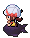

# Route 34 Wild Pokémon

### Grass

| Sprite | Pokémon | Encounter Type | Level | Chance |
|:------:|---------|:--------------:|-------|--------|
|  | Drowzee | {: style="max-width: 24px;"" } | 15 – 19 | 20% |
|  | Gulpin | {: style="max-width: 24px;"" } | 15 – 19 | 20% |
|  | Electrike | {: style="max-width: 24px;"" } | 15 – 19 | 10% |
|  | Bonsly | {: style="max-width: 24px;"" } | 15 – 19 | 10% |
|  | Mime Jr. | {: style="max-width: 24px;"" } | 15 – 19 | 10% |
|  | Abra | {: style="max-width: 24px;"" } | 15 – 19 | 10% |
|  | Ditto | {: style="max-width: 24px;"" } | 15 – 19 | 9% |
|  | Snubbull | {: style="max-width: 24px;"" } | 15 – 19 | 9% |
|  | Kadabra | {: style="max-width: 24px;"" } | 15 – 19 | 2% |

### Surf

| Sprite | Pokémon | Encounter Type | Level | Chance |
|:------:|---------|:--------------:|-------|--------|
|  | Tentacool | {: style="max-width: 24px;"" } | 15 – 19 | 95% |
|  | Tentacruel | {: style="max-width: 24px;"" } | 15 – 19 | 5% |

### Old Rod

| Sprite | Pokémon | Encounter Type | Level | Chance |
|:------:|---------|:--------------:|-------|--------|
|  | Goldeen | {: style="max-width: 24px;"" } | 10 | 60% |
|  | Chinchou | {: style="max-width: 24px;"" } | 10 | 30% |
|  | Staryu | {: style="max-width: 24px;"" } | 10 | 10% |

### Good Rod

| Sprite | Pokémon | Encounter Type | Level | Chance |
|:------:|---------|:--------------:|-------|--------|
|  | Goldeen | {: style="max-width: 24px;"" } | 25 | 60% |
|  | Chinchou | {: style="max-width: 24px;"" } | 25 | 30% |
|  | Staryu | {: style="max-width: 24px;"" } | 25 | 10% |

### Super Rod

| Sprite | Pokémon | Encounter Type | Level | Chance |
|:------:|---------|:--------------:|-------|--------|
|  | Seaking | {: style="max-width: 24px;"" } | 50 | 60% |
|  | Staryu | {: style="max-width: 24px;"" } | 50 | 30% |
|  | Lanturn | {: style="max-width: 24px;"" } | 50 | 5% |
|  | Starmie | {: style="max-width: 24px;"" } | 50 | 5% |

### Meridian Sound

| Sprite | Pokémon | Encounter Type | Level | Chance |
|:------:|---------|:--------------:|-------|--------|
|  | Manectric | {: style="max-width: 24px;"" } | 15 – 19 | 50% |
|  | Hypno | {: style="max-width: 24px;"" } | 15 – 19 | 50% |

### Pastoral Sound

| Sprite | Pokémon | Encounter Type | Level | Chance |
|:------:|---------|:--------------:|-------|--------|
|  | Ralts | {: style="max-width: 24px;"" } | 15 – 19 | 50% |
|  | Kirlia | {: style="max-width: 24px;"" } | 15 – 19 | 50% |

### Swarm

| Sprite | Pokémon | Encounter Type | Level | Chance |
|:------:|---------|:--------------:|-------|--------|
|  | Kadabra | {: style="max-width: 24px;"" } | 15 – 19 | 100% |

