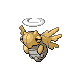

# Route 35 — Trainer Rosters

### Generic Trainers

| Trainer | P1 | P2 | P3 | P4 | P5 | P6 |
|:-------:|:--:|:--:|:--:|:--:|:--:|:--:|
|  Bird Keeper Bryan |  [Hoothoot](../../pokemon/hoothoot.md/) Lv. 20 |  [Noctowl](../../pokemon/noctowl.md/) Lv. 20 |
|  Lady Kim |  [Skiploom](../../pokemon/skiploom.md/) Lv. 20 |  [Combusken](../../pokemon/combusken.md/) Lv. 20 |
|  Camper Elliot |  [Sandshrew](../../pokemon/sandshrew.md/) Lv. 20 |  [Flaaffy](../../pokemon/flaaffy.md/) Lv. 20 |
|  Picnicker Brook |  [Pichu](../../pokemon/pichu.md/) Lv. 20 |  [Pikachu](../../pokemon/pikachu.md/) Lv. 20 |
|  Camper Ivan |  [Diglett](../../pokemon/diglett.md/) Lv. 20 |  [Zigzagoon](../../pokemon/zigzagoon.md/) Lv. 20 |  [Linoone](../../pokemon/linoone.md/) Lv. 20 |
|  Juggler Irwin |  [Voltorb](../../pokemon/voltorb.md/) Lv. 12 |  [Voltorb](../../pokemon/voltorb.md/) Lv. 16 |  [Voltorb](../../pokemon/voltorb.md/) Lv. 20 |  [Voltorb](../../pokemon/voltorb.md/) Lv. 24 |
| ") Firebreather Walt [(!)](#rematches) |  [Stunky](../../pokemon/stunky.md/) Lv. 18 |  [Magmar](../../pokemon/magmar.md/) Lv. 21 |
|  Policeman Dirk |  [Houndour](../../pokemon/houndour.md/) Lv. 22 |  [Mightyena](../../pokemon/mightyena.md/) Lv. 22 |
| ") Bug Catcher Arnie [(!)](#rematches) |  [Paras](../../pokemon/paras.md/) Lv. 21 |  [Venonat](../../pokemon/venonat.md/) Lv. 21 |

### Rematches

| Trainer | P1 | P2 | P3 | P4 | P5 | P6 |
|:-------:|:--:|:--:|:--:|:--:|:--:|:--:|
| ") Firebreather Walt (M10a-8p) |  [Skuntank](../../pokemon/skuntank.md/) Lv. 45 |  [Magmar](../../pokemon/magmar.md/) Lv. 45 |
| ") Firebreather Walt (M10a-8p) |  [Skuntank](../../pokemon/skuntank.md/) Lv. 53 |  [Magmortar](../../pokemon/magmortar.md/) Lv. 53 |
| ") Firebreather Walt (M10a-8p) |  [Weezing](../../pokemon/weezing.md/) Lv. 66 |  [Skuntank](../../pokemon/skuntank.md/) Lv. 66 |  [Magmortar](../../pokemon/magmortar.md/) Lv. 66 |
| ") Bug Catcher Arnie (T4a-10a) |  [Venomoth](../../pokemon/venomoth.md/) Lv. 47 |  [Parasect](../../pokemon/parasect.md/) Lv. 47 |
| ") Bug Catcher Arnie (T4a-10a) |  [Venomoth](../../pokemon/venomoth.md/) Lv. 54 |  [Parasect](../../pokemon/parasect.md/) Lv. 54 |
| ") Bug Catcher Arnie (T4a-10a) |  [Ninjask](../../pokemon/ninjask.md/) Lv. 68 |  [Shedinja](../../pokemon/shedinja.md/) Lv. 68 |  [Venomoth](../../pokemon/venomoth.md/) Lv. 68 |  [Parasect](../../pokemon/parasect.md/) Lv. 68 |

