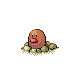

# Route 35 — Trainer Rosters

### Generic Trainers

| Trainer | P1 | P2 | P3 | P4 | P5 | P6 |
|:-------:|:--:|:--:|:--:|:--:|:--:|:--:|
|  Bird Keeper Bryan |  Hoothoot Lv. 20 |  Noctowl Lv. 20 |
|  Lady Kim |  Skiploom Lv. 20 |  Combusken Lv. 20 |
|  Camper Elliot |  Sandshrew Lv. 20 |  Flaaffy Lv. 20 |
|  Picnicker Brook |  Pichu Lv. 20 |  Pikachu Lv. 20 |
|  Camper Ivan |  Diglett Lv. 20 |  Zigzagoon Lv. 20 |  Linoone Lv. 20 |
|  Juggler Irwin |  Voltorb Lv. 12 |  Voltorb Lv. 16 |  Voltorb Lv. 20 |  Voltorb Lv. 24 |
| ") Firebreather Walt [(!)](#rematches) |  Stunky Lv. 18 |  Magmar Lv. 21 |
|  Policeman Dirk |  Houndour Lv. 22 |  Mightyena Lv. 22 |
| ") Bug Catcher Arnie [(!)](#rematches) |  Paras Lv. 21 |  Venonat Lv. 21 |

### Rematches

| Trainer | P1 | P2 | P3 | P4 | P5 | P6 |
|:-------:|:--:|:--:|:--:|:--:|:--:|:--:|
| ") Firebreather Walt (M10a-8p) |  Skuntank Lv. 45 |  Magmar Lv. 45 |
| ") Firebreather Walt (M10a-8p) |  Skuntank Lv. 53 |  Magmortar Lv. 53 |
| ") Firebreather Walt (M10a-8p) |  Weezing Lv. 66 |  Skuntank Lv. 66 |  Magmortar Lv. 66 |
| ") Bug Catcher Arnie (T4a-10a) |  Venomoth Lv. 47 |  Parasect Lv. 47 |
| ") Bug Catcher Arnie (T4a-10a) |  Venomoth Lv. 54 |  Parasect Lv. 54 |
| ") Bug Catcher Arnie (T4a-10a) |  Ninjask Lv. 68 |  Shedinja Lv. 68 |  Venomoth Lv. 68 |  Parasect Lv. 68 |

