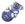

# Route 35 — Wild Pokémon

### Grass, Morning / Day

| Sprite | Pokémon | Encounter Type | Level | Chance |
|:------:|---------|:--------------:|-------|--------|
|  | Nidoran M | {: style="max-width: 24px;"" } {: style="max-width: 24px;"" } {: style="max-width: 24px;"" } | 17 – 19 | 20% |
|  | Nidoran F | {: style="max-width: 24px;"" } {: style="max-width: 24px;"" } {: style="max-width: 24px;"" } | 17 – 19 | 20% |
|  | Pidgeotto | {: style="max-width: 24px;"" } {: style="max-width: 24px;"" } {: style="max-width: 24px;"" } | 17 – 19 | 10% |
|  | Stunky | {: style="max-width: 24px;"" } {: style="max-width: 24px;"" } {: style="max-width: 24px;"" } | 17 – 19 | 10% |
|  | Glameow | {: style="max-width: 24px;"" } {: style="max-width: 24px;"" } {: style="max-width: 24px;"" } | 17 – 19 | 10% |
|  | Staravia | {: style="max-width: 24px;"" } {: style="max-width: 24px;"" } {: style="max-width: 24px;"" } | 17 – 19 | 10% |
|  | Illumise | {: style="max-width: 24px;"" } {: style="max-width: 24px;"" } {: style="max-width: 24px;"" } | 17 – 19 | 5% |
|  | Volbeat | {: style="max-width: 24px;"" } {: style="max-width: 24px;"" } {: style="max-width: 24px;"" } | 17 – 19 | 5% |
|  | Ditto | {: style="max-width: 24px;"" } {: style="max-width: 24px;"" } {: style="max-width: 24px;"" } | 17 – 19 | 5% |
|  | Yanma | {: style="max-width: 24px;"" } {: style="max-width: 24px;"" } {: style="max-width: 24px;"" } | 17 – 19 | 5% |

### Grass, Night

| Sprite | Pokémon | Encounter Type | Level | Chance |
|:------:|---------|:--------------:|-------|--------|
|  | Nidoran M | {: style="max-width: 24px;"" } {: style="max-width: 24px;"" } | 17 – 19 | 20% |
|  | Nidoran F | {: style="max-width: 24px;"" } {: style="max-width: 24px;"" } | 17 – 19 | 20% |
|  | Meowth | {: style="max-width: 24px;"" } {: style="max-width: 24px;"" } | 17 – 19 | 10% |
|  | Stunky | {: style="max-width: 24px;"" } {: style="max-width: 24px;"" } | 17 – 19 | 10% |
|  | Glameow | {: style="max-width: 24px;"" } {: style="max-width: 24px;"" } | 17 – 19 | 10% |
|  | Noctowl | {: style="max-width: 24px;"" } {: style="max-width: 24px;"" } | 17 – 19 | 10% |
|  | Illumise | {: style="max-width: 24px;"" } {: style="max-width: 24px;"" } | 17 – 19 | 5% |
|  | Volbeat | {: style="max-width: 24px;"" } {: style="max-width: 24px;"" } | 17 – 19 | 5% |
|  | Ditto | {: style="max-width: 24px;"" } {: style="max-width: 24px;"" } | 17 – 19 | 5% |
|  | Yanma | {: style="max-width: 24px;"" } {: style="max-width: 24px;"" } | 17 – 19 | 5% |

### Surf

| Sprite | Pokémon | Encounter Type | Level | Chance |
|:------:|---------|:--------------:|-------|--------|
|  | Psyduck | {: style="max-width: 24px;"" } | 17 – 19 | 90% |
|  | Golduck | {: style="max-width: 24px;"" } | 17 – 19 | 10% |

### Old Rod

| Sprite | Pokémon | Encounter Type | Level | Chance |
|:------:|---------|:--------------:|-------|--------|
|  | Magikarp | {: style="max-width: 24px;"" } | 10 | 65% |
|  | Psyduck | {: style="max-width: 24px;"" } | 10 | 35% |

### Good Rod

| Sprite | Pokémon | Encounter Type | Level | Chance |
|:------:|---------|:--------------:|-------|--------|
|  | Magikarp | {: style="max-width: 24px;"" } | 25 | 60% |
|  | Luvdisc | {: style="max-width: 24px;"" } | 25 | 35% |
|  | Psyduck | {: style="max-width: 24px;"" } | 25 | 5% |

### Super Rod

| Sprite | Pokémon | Encounter Type | Level | Chance |
|:------:|---------|:--------------:|-------|--------|
|  | Luvdisc | {: style="max-width: 24px;"" } | 50 | 60% |
|  | Psyduck | {: style="max-width: 24px;"" } | 50 | 35% |
|  | Gyarados | {: style="max-width: 24px;"" } | 50 | 5% |

### Meridian Sound

| Sprite | Pokémon | Encounter Type | Level | Chance |
|:------:|---------|:--------------:|-------|--------|
|  | Skuntank | {: style="max-width: 24px;"" } | 17 – 19 | 50% |
|  | Purugly | {: style="max-width: 24px;"" } | 17 – 19 | 50% |

### Pastoral Sound

| Sprite | Pokémon | Encounter Type | Level | Chance |
|:------:|---------|:--------------:|-------|--------|
|  | Yanma | {: style="max-width: 24px;"" } | 17 – 19 | 100% |

### Swarm

| Sprite | Pokémon | Encounter Type | Level | Chance |
|:------:|---------|:--------------:|-------|--------|
|  | Illumise | {: style="max-width: 24px;"" } | 17 – 19 | 100% |
|  | Volbeat | {: style="max-width: 24px;"" } | 17 – 19 | 100% |

