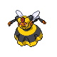

# Route 36 Wild Pokémon

### Grass, Morning / Day

| Sprite | Pokémon | Encounter Type | Level | Chance |
|:------:|---------|:--------------:|-------|--------|
|  | Growlithe | {: style="max-width: 24px;"" } {: style="max-width: 24px;"" } {: style="max-width: 24px;"" } | 17 – 19 | 20% |
|  | Vulpix | {: style="max-width: 24px;"" } {: style="max-width: 24px;"" } {: style="max-width: 24px;"" } | 17 – 19 | 20% |
|  | Combee | {: style="max-width: 24px;"" } {: style="max-width: 24px;"" } {: style="max-width: 24px;"" } | 17 – 19 | 10% |
|  | Plusle | {: style="max-width: 24px;"" } {: style="max-width: 24px;"" } {: style="max-width: 24px;"" } | 17 – 19 | 10% |
|  | Minun | {: style="max-width: 24px;"" } {: style="max-width: 24px;"" } {: style="max-width: 24px;"" } | 17 – 19 | 10% |
|  | Nidorino | {: style="max-width: 24px;"" } {: style="max-width: 24px;"" } {: style="max-width: 24px;"" } | 17 – 19 | 10% |
|  | Nidorina | {: style="max-width: 24px;"" } {: style="max-width: 24px;"" } {: style="max-width: 24px;"" } | 17 – 19 | 10% |
|  | Staravia | {: style="max-width: 24px;"" } {: style="max-width: 24px;"" } {: style="max-width: 24px;"" } | 17 – 19 | 5% |
|  | Stantler | {: style="max-width: 24px;"" } {: style="max-width: 24px;"" } {: style="max-width: 24px;"" } | 17 – 19 | 5% |

### Grass, Night

| Sprite | Pokémon | Encounter Type | Level | Chance |
|:------:|---------|:--------------:|-------|--------|
|  | Growlithe | {: style="max-width: 24px;"" } {: style="max-width: 24px;"" } | 17 – 19 | 20% |
|  | Vulpix | {: style="max-width: 24px;"" } {: style="max-width: 24px;"" } | 17 – 19 | 20% |
|  | Combee | {: style="max-width: 24px;"" } {: style="max-width: 24px;"" } | 17 – 19 | 10% |
|  | Plusle | {: style="max-width: 24px;"" } {: style="max-width: 24px;"" } | 17 – 19 | 10% |
|  | Minun | {: style="max-width: 24px;"" } {: style="max-width: 24px;"" } | 17 – 19 | 10% |
|  | Nidorino | {: style="max-width: 24px;"" } {: style="max-width: 24px;"" } | 17 – 19 | 10% |
|  | Nidorina | {: style="max-width: 24px;"" } {: style="max-width: 24px;"" } | 17 – 19 | 10% |
|  | Noctowl | {: style="max-width: 24px;"" } {: style="max-width: 24px;"" } | 17 – 19 | 5% |
|  | Stantler | {: style="max-width: 24px;"" } {: style="max-width: 24px;"" } | 17 – 19 | 5% |

### Meridian Sound

| Sprite | Pokémon | Encounter Type | Level | Chance |
|:------:|---------|:--------------:|-------|--------|
|  | Vespiquen | {: style="max-width: 24px;"" } | 17 – 19 | 100% |

### Pastoral Sound

| Sprite | Pokémon | Encounter Type | Level | Chance |
|:------:|---------|:--------------:|-------|--------|
|  | Bonsly | {: style="max-width: 24px;"" } | 17 – 19 | 50% |
|  | Mime Jr. | {: style="max-width: 24px;"" } | 17 – 19 | 50% |

