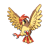

# Route 37 — Wild Pokémon

### Grass, Morning / Day

| Sprite | Pokémon | Encounter Type | Level | Chance |
|:------:|---------|:--------------:|-------|--------|
|  | [Growlithe](../../pokemon/growlithe.md) | encounter_sprites| 21 – 24 | 20% |
|  | [Vulpix](../../pokemon/vulpix.md) | encounter_sprites| 21 – 24 | 20% |
|  | [Stantler](../../pokemon/stantler.md) | encounter_sprites| 21 – 24 | 10% |
|  | [Ledian](../../pokemon/ledian.md) | encounter_sprites| 21 – 24 | 10% |
|  | [Pidgeotto](../../pokemon/pidgeotto.md) | encounter_sprites| 21 – 24 | 10% |
|  | [Nidorino](../../pokemon/nidorino.md) | encounter_sprites| 21 – 24 | 10% |
|  | [Nidorina](../../pokemon/nidorina.md) | encounter_sprites| 21 – 24 | 10% |
|  | [Zangoose](../../pokemon/zangoose.md) | encounter_sprites| 21 – 24 | 5% |
|  | [Seviper](../../pokemon/seviper.md) | encounter_sprites| 21 – 24 | 5% |

### Grass, Night

| Sprite | Pokémon | Encounter Type | Level | Chance |
|:------:|---------|:--------------:|-------|--------|
|  | [Growlithe](../../pokemon/growlithe.md) | encounter_sprites| 21 – 24 | 20% |
|  | [Vulpix](../../pokemon/vulpix.md) | encounter_sprites| 21 – 24 | 20% |
|  | [Stantler](../../pokemon/stantler.md) | encounter_sprites| 21 – 24 | 10% |
|  | [Ariados](../../pokemon/ariados.md) | encounter_sprites| 21 – 24 | 10% |
|  | [Noctowl](../../pokemon/noctowl.md) | encounter_sprites| 21 – 24 | 10% |
|  | [Mightyena](../../pokemon/mightyena.md) | encounter_sprites| 21 – 24 | 10% |
|  | [Linoone](../../pokemon/linoone.md) | encounter_sprites| 21 – 24 | 10% |
|  | [Zangoose](../../pokemon/zangoose.md) | encounter_sprites| 21 – 24 | 5% |
|  | [Seviper](../../pokemon/seviper.md) | encounter_sprites| 21 – 24 | 5% |

### Meridian Sound

| Sprite | Pokémon | Encounter Type | Level | Chance |
|:------:|---------|:--------------:|-------|--------|
|  | [Arcanine](../../pokemon/arcanine.md) | encounter_sprites| 21 – 24 | 50% |
|  | [Ninetales](../../pokemon/ninetales.md) | encounter_sprites| 21 – 24 | 50% |

### Pastoral Sound

| Sprite | Pokémon | Encounter Type | Level | Chance |
|:------:|---------|:--------------:|-------|--------|
|  | [Zangoose](../../pokemon/zangoose.md) | encounter_sprites| 21 – 24 | 50% |
|  | [Seviper](../../pokemon/seviper.md) | encounter_sprites| 21 – 24 | 50% |

