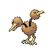

# Route 38 — Trainer Rosters

### Generic Trainers

| Trainer | P1 | P2 | P3 | P4 | P5 | P6 |
|:-------:|:--:|:--:|:--:|:--:|:--:|:--:|
|  Sailor Harry |  Kingler Lv. 29 |  Quagsire Lv. 29 |
| ") Lass Dana [(!)](#rematches) |  Psyduck Lv. 28 |  Ampharos Lv. 30 |
|  Beauty Valerie |  Skiploom Lv. 27 |  Roselia Lv. 27 |  Vileplume Lv. 27 |
| ") School Kid Chad [(!)](#rematches) |  Mr. Mime Lv. 28 |  Sudowoodo Lv. 28 |
|  Bird Keeper Toby |  Doduo Lv. 27 |  Chatot Lv. 27 |  Swellow Lv. 27 |

### Rematches

| Trainer | P1 | P2 | P3 | P4 | P5 | P6 |
|:-------:|:--:|:--:|:--:|:--:|:--:|:--:|
| ") Lass Dana (Th8p-5a) |  Ampharos Lv. 48 |  Golduck Lv. 48 |
| ") Lass Dana (Th8p-5a) |  Golduck Lv. 52 |  Ampharos Lv. 52 |
| ") Lass Dana (Th8p-5a) |  Golduck Lv. 69 |  Ampharos Lv. 69 |
| ") School Kid Chad (F4a-10a) |  Mr. Mime Lv. 46 |  Sudowoodo Lv. 46 |
| ") School Kid Chad (F4a-10a) |  Mr. Mime Lv. 53 |  Sudowoodo Lv. 53 |
| ") School Kid Chad (F4a-10a) |  Mr. Mime Lv. 68 |  Sudowoodo Lv. 68 |

