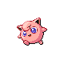

# Route 39 — Trainer Rosters

### Generic Trainers

| Trainer | P1 | P2 | P3 | P4 | P5 | P6 |
|:-------:|:--:|:--:|:--:|:--:|:--:|:--:|
|  Cowgirl Tay-Tay |  Ponyta Lv. 29 |  Tauros Lv. 29 |
|  Rancher Bobbie |  Aipom Lv. 28 |  Ponyta Lv. 28 |  Miltank Lv. 28 |
|  Pokefan Derek |  Cleffa Lv. 28 |  Clefairy Lv. 28 |  Clefable Lv. 28 |
|  Pokefan Ruth |  Igglybuff Lv. 28 |  Jigglypuff Lv. 28 |  Wigglytuff Lv. 28 |

