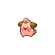

# Trainer Rosters

### Generic Trainers

| Trainer | P1 | P2 | P3 | P4 | P5 | P6 |
|:-------:|:--:|:--:|:--:|:--:|:--:|:--:|
|  Cowgirl Tay-Tay |  [Ponyta](../../pokemon/ponyta.md/) Lv. 29 |  [Tauros](../../pokemon/tauros.md/) Lv. 29 |
|  Rancher Bobbie |  [Aipom](../../pokemon/aipom.md/) Lv. 28 |  [Ponyta](../../pokemon/ponyta.md/) Lv. 28 |  [Miltank](../../pokemon/miltank.md/) Lv. 28 |
|  Pokefan Derek |  [Cleffa](../../pokemon/cleffa.md/) Lv. 28 |  [Clefairy](../../pokemon/clefairy.md/) Lv. 28 |  [Clefable](../../pokemon/clefable.md/) Lv. 28 |
|  Pokefan Ruth |  [Igglybuff](../../pokemon/igglybuff.md/) Lv. 28 |  [Jigglypuff](../../pokemon/jigglypuff.md/) Lv. 28 |  [Wigglytuff](../../pokemon/wigglytuff.md/) Lv. 28 |

