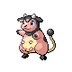
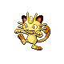

# Route 39 — Wild Pokémon

### Grass, Morning / Day

| Sprite | Pokémon | Encounter Type | Level | Chance |
|:------:|---------|:--------------:|-------|--------|
|  | [Raticate](../../pokemon/raticate.md) | {: style="max-width: 24px;"" } {: style="max-width: 24px;"" } {: style="max-width: 24px;"" }| 27 – 28 | 20% |
|  | [Ponyta](../../pokemon/ponyta.md) | {: style="max-width: 24px;"" } {: style="max-width: 24px;"" } {: style="max-width: 24px;"" }| 27 – 28 | 20% |
|  | [Elekid](../../pokemon/elekid.md) | {: style="max-width: 24px;"" } {: style="max-width: 24px;"" } {: style="max-width: 24px;"" }| 27 – 28 | 10% |
|  | [Mankey](../../pokemon/mankey.md) | {: style="max-width: 24px;"" } {: style="max-width: 24px;"" } {: style="max-width: 24px;"" }| 27 – 28 | 10% |
|  | [Voltorb](../../pokemon/voltorb.md) | {: style="max-width: 24px;"" } {: style="max-width: 24px;"" } {: style="max-width: 24px;"" }| 27 – 28 | 10% |
|  | [Cherubi](../../pokemon/cherubi.md) | {: style="max-width: 24px;"" } {: style="max-width: 24px;"" } {: style="max-width: 24px;"" }| 27 – 28 | 10% |
|  | [Farfetch’d](../../pokemon/farfetchd.md) | {: style="max-width: 24px;"" } {: style="max-width: 24px;"" } {: style="max-width: 24px;"" }| 27 – 28 | 5% |
|  | [Miltank](../../pokemon/miltank.md) | {: style="max-width: 24px;"" } {: style="max-width: 24px;"" } {: style="max-width: 24px;"" }| 27 – 28 | 5% |
|  | [Tauros](../../pokemon/tauros.md) | {: style="max-width: 24px;"" } {: style="max-width: 24px;"" } {: style="max-width: 24px;"" }| 27 – 28 | 5% |
|  | [Pidgeotto](../../pokemon/pidgeotto.md) | {: style="max-width: 24px;"" } {: style="max-width: 24px;"" } {: style="max-width: 24px;"" }| 27 – 28 | 5% |

### Grass, Night

| Sprite | Pokémon | Encounter Type | Level | Chance |
|:------:|---------|:--------------:|-------|--------|
|  | [Raticate](../../pokemon/raticate.md) | {: style="max-width: 24px;"" } {: style="max-width: 24px;"" }| 27 – 28 | 20% |
|  | [Ponyta](../../pokemon/ponyta.md) | {: style="max-width: 24px;"" } {: style="max-width: 24px;"" }| 27 – 28 | 20% |
|  | [Elekid](../../pokemon/elekid.md) | {: style="max-width: 24px;"" } {: style="max-width: 24px;"" }| 27 – 28 | 10% |
|  | [Mankey](../../pokemon/mankey.md) | {: style="max-width: 24px;"" } {: style="max-width: 24px;"" }| 27 – 28 | 10% |
|  | [Voltorb](../../pokemon/voltorb.md) | {: style="max-width: 24px;"" } {: style="max-width: 24px;"" }| 27 – 28 | 10% |
|  | [Meowth](../../pokemon/meowth.md) | {: style="max-width: 24px;"" } {: style="max-width: 24px;"" }| 27 – 28 | 10% |
|  | [Farfetch’d](../../pokemon/farfetchd.md) | {: style="max-width: 24px;"" } {: style="max-width: 24px;"" }| 27 – 28 | 5% |
|  | [Miltank](../../pokemon/miltank.md) | {: style="max-width: 24px;"" } {: style="max-width: 24px;"" }| 27 – 28 | 5% |
|  | [Tauros](../../pokemon/tauros.md) | {: style="max-width: 24px;"" } {: style="max-width: 24px;"" }| 27 – 28 | 5% |
|  | [Skitty](../../pokemon/skitty.md) | {: style="max-width: 24px;"" } {: style="max-width: 24px;"" }| 27 – 28 | 5% |

### Meridian Sound

| Sprite | Pokémon | Encounter Type | Level | Chance |
|:------:|---------|:--------------:|-------|--------|
|  | [Rapidash](../../pokemon/rapidash.md) | {: style="max-width: 24px;"" }| 27 – 28 | 50% |
|  | [Primeape](../../pokemon/primeape.md) | {: style="max-width: 24px;"" }| 27 – 28 | 50% |

### Pastoral Sound

| Sprite | Pokémon | Encounter Type | Level | Chance |
|:------:|---------|:--------------:|-------|--------|
|  | [Skitty](../../pokemon/skitty.md) | {: style="max-width: 24px;"" }| 27 – 28 | 50% |
|  | [Cherubi](../../pokemon/cherubi.md) | {: style="max-width: 24px;"" }| 27 – 28 | 50% |

