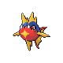

# Route 40 — Trainer Rosters

### Generic Trainers

| Trainer | P1 | P2 | P3 | P4 | P5 | P6 |
|:-------:|:--:|:--:|:--:|:--:|:--:|:--:|
|  Swimmer Simon |  Staryu Lv. 28 |  Tentacool Lv. 28 |  Qwilfish Lv. 28 |
|  Swimmer Elaine |  Luvdisc Lv. 29 |  Corsola Lv. 29 |  Octillery Lv. 29 |
|  Swimmer Randall |  Carvanha Lv. 28 |  Wailmer Lv. 28 |  Clamperl Lv. 28 |  Barboach Lv. 28 |
|  Swimmer Paula |  Finneon Lv. 29 |  Lanturn Lv. 29 |

