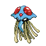

# Route 40 — Wild Pokémon

### Surf

| Sprite | Pokémon | Encounter Type | Level | Chance |
|:------:|---------|:--------------:|-------|--------|
|  | [Wingull](../../pokemon/wingull.md) | {: style="max-width: 24px;"" }| 25 – 35 | 60% |
|  | [Tentacool](../../pokemon/tentacool.md) | {: style="max-width: 24px;"" }| 25 – 35 | 30% |
|  | [Pelipper](../../pokemon/pelipper.md) | {: style="max-width: 24px;"" }| 25 – 35 | 5% |
|  | [Tentacruel](../../pokemon/tentacruel.md) | {: style="max-width: 24px;"" }| 25 – 35 | 3% |
|  | [Phione](../../pokemon/phione.md) | {: style="max-width: 24px;"" }| 25 – 35 | 2% |

### Old Rod

| Sprite | Pokémon | Encounter Type | Level | Chance |
|:------:|---------|:--------------:|-------|--------|
|  | [Magikarp](../../pokemon/magikarp.md) | {: style="max-width: 24px;"" }| 10 | 60% |
|  | [Tentacool](../../pokemon/tentacool.md) | {: style="max-width: 24px;"" }| 10 | 40% |

### Good Rod

| Sprite | Pokémon | Encounter Type | Level | Chance |
|:------:|---------|:--------------:|-------|--------|
|  | [Staryu](../../pokemon/staryu.md) | {: style="max-width: 24px;"" }| 25 | 60% |
|  | [Finneon](../../pokemon/finneon.md) | {: style="max-width: 24px;"" }| 25 | 35% |
|  | [Corsola](../../pokemon/corsola.md) | {: style="max-width: 24px;"" }| 25 | 5% |

### Super Rod

| Sprite | Pokémon | Encounter Type | Level | Chance |
|:------:|---------|:--------------:|-------|--------|
|  | [Finneon](../../pokemon/finneon.md) | {: style="max-width: 24px;"" }| 50 | 60% |
|  | [Corsola](../../pokemon/corsola.md) | {: style="max-width: 24px;"" }| 50 | 30% |
|  | [Lumineon](../../pokemon/lumineon.md) | {: style="max-width: 24px;"" }| 50 | 10% |

