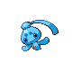

# Route 40 Wild Pokémon

### Surf

| Sprite | Pokémon | Encounter Type | Level | Chance |
|:------:|---------|:--------------:|-------|--------|
|  | Wingull | {: style="max-width: 24px;"" } | 25 – 35 | 60% |
|  | Tentacool | {: style="max-width: 24px;"" } | 25 – 35 | 30% |
|  | Pelipper | {: style="max-width: 24px;"" } | 25 – 35 | 5% |
|  | Tentacruel | {: style="max-width: 24px;"" } | 25 – 35 | 3% |
|  | Phione | {: style="max-width: 24px;"" } | 25 – 35 | 2% |

### Old Rod

| Sprite | Pokémon | Encounter Type | Level | Chance |
|:------:|---------|:--------------:|-------|--------|
|  | Magikarp | {: style="max-width: 24px;"" } | 10 | 60% |
|  | Tentacool | {: style="max-width: 24px;"" } | 10 | 40% |

### Good Rod

| Sprite | Pokémon | Encounter Type | Level | Chance |
|:------:|---------|:--------------:|-------|--------|
|  | Staryu | {: style="max-width: 24px;"" } | 25 | 60% |
|  | Finneon | {: style="max-width: 24px;"" } | 25 | 35% |
|  | Corsola | {: style="max-width: 24px;"" } | 25 | 5% |

### Super Rod

| Sprite | Pokémon | Encounter Type | Level | Chance |
|:------:|---------|:--------------:|-------|--------|
|  | Finneon | {: style="max-width: 24px;"" } | 50 | 60% |
|  | Corsola | {: style="max-width: 24px;"" } | 50 | 30% |
|  | Lumineon | {: style="max-width: 24px;"" } | 50 | 10% |

