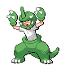

# Route 42 — Trainer Rosters

### Generic Trainers

| Trainer | P1 | P2 | P3 | P4 | P5 | P6 |
|:-------:|:--:|:--:|:--:|:--:|:--:|:--:|
| ") Fisherman Tully [(!)](#rematches) |  Qwilfish Lv. 37 |  Octillery Lv. 37 |
|  Poke Maniac Shane |  Nidoqueen Lv. 38 |  Slowbro Lv. 38 |
|  Hiker Benjamin |  Graveler Lv. 37 |  Sudowoodo Lv. 37 |  Forretress Lv. 37 |

### Rematches

| Trainer | P1 | P2 | P3 | P4 | P5 | P6 |
|:-------:|:--:|:--:|:--:|:--:|:--:|:--:|
| ") Fisherman Tully (Su10a-8p) |  Qwilfish Lv. 46 |  Octillery Lv. 46 |
| ") Fisherman Tully (Su10a-8p) |  Qwilfish Lv. 54 |  Octillery Lv. 54 |  Seaking Lv. 54 |
| ") Fisherman Tully (Su10a-8p) |  Qwilfish Lv. 68 |  Octillery Lv. 68 |  Seaking Lv. 68 |

