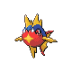

# Route 42 Wild Pokémon

### Grass, Morning / Day

| Sprite | Pokémon | Encounter Type | Level | Chance |
|:------:|---------|:--------------:|-------|--------|
|  | Flaaffy | {: style="max-width: 24px;"" } {: style="max-width: 24px;"" } {: style="max-width: 24px;"" } | 30 – 32 | 20% |
|  | Fearow | {: style="max-width: 24px;"" } {: style="max-width: 24px;"" } {: style="max-width: 24px;"" } | 30 – 32 | 20% |
|  | Hippopotas | {: style="max-width: 24px;"" } {: style="max-width: 24px;"" } {: style="max-width: 24px;"" } | 30 – 32 | 10% |
|  | Cacnea | {: style="max-width: 24px;"" } {: style="max-width: 24px;"" } {: style="max-width: 24px;"" } | 30 – 32 | 10% |
|  | Arbok | {: style="max-width: 24px;"" } {: style="max-width: 24px;"" } {: style="max-width: 24px;"" } | 30 – 32 | 10% |
|  | Sandslash | {: style="max-width: 24px;"" } {: style="max-width: 24px;"" } {: style="max-width: 24px;"" } | 30 – 32 | 10% |
|  | Munchlax | {: style="max-width: 24px;"" } {: style="max-width: 24px;"" } {: style="max-width: 24px;"" } | 30 – 32 | 10% |
|  | Trapinch | {: style="max-width: 24px;"" } {: style="max-width: 24px;"" } {: style="max-width: 24px;"" } | 30 – 32 | 10% |

### Grass, Night

| Sprite | Pokémon | Encounter Type | Level | Chance |
|:------:|---------|:--------------:|-------|--------|
|  | Flaaffy | {: style="max-width: 24px;"" } {: style="max-width: 24px;"" } | 30 – 32 | 20% |
|  | Golbat | {: style="max-width: 24px;"" } {: style="max-width: 24px;"" } | 30 – 32 | 20% |
|  | Hippopotas | {: style="max-width: 24px;"" } {: style="max-width: 24px;"" } | 30 – 32 | 10% |
|  | Cacnea | {: style="max-width: 24px;"" } {: style="max-width: 24px;"" } | 30 – 32 | 10% |
|  | Arbok | {: style="max-width: 24px;"" } {: style="max-width: 24px;"" } | 30 – 32 | 10% |
|  | Sandslash | {: style="max-width: 24px;"" } {: style="max-width: 24px;"" } | 30 – 32 | 10% |
|  | Munchlax | {: style="max-width: 24px;"" } {: style="max-width: 24px;"" } | 30 – 32 | 10% |
|  | Trapinch | {: style="max-width: 24px;"" } {: style="max-width: 24px;"" } | 30 – 32 | 10% |

### Meridian Sound

| Sprite | Pokémon | Encounter Type | Level | Chance |
|:------:|---------|:--------------:|-------|--------|
|  | Cacturne | {: style="max-width: 24px;"" } | 30 – 32 | 50% |
|  | Vibrava | {: style="max-width: 24px;"" } | 30 – 32 | 50% |

### Pastoral Sound

| Sprite | Pokémon | Encounter Type | Level | Chance |
|:------:|---------|:--------------:|-------|--------|
|  | Tyrogue | {: style="max-width: 24px;"" } | 30 – 32 | 100% |

### Surf

| Sprite | Pokémon | Encounter Type | Level | Chance |
|:------:|---------|:--------------:|-------|--------|
|  | Goldeen | {: style="max-width: 24px;"" } | 30 – 32 | 95% |
|  | Seaking | {: style="max-width: 24px;"" } | 30 – 32 | 5% |

### Old Rod

| Sprite | Pokémon | Encounter Type | Level | Chance |
|:------:|---------|:--------------:|-------|--------|
|  | Goldeen | {: style="max-width: 24px;"" } | 10 | 100% |

### Good Rod

| Sprite | Pokémon | Encounter Type | Level | Chance |
|:------:|---------|:--------------:|-------|--------|
|  | Goldeen | {: style="max-width: 24px;"" } | 25 | 65% |
|  | Carvanha | {: style="max-width: 24px;"" } | 25 | 35% |

### Super Rod

| Sprite | Pokémon | Encounter Type | Level | Chance |
|:------:|---------|:--------------:|-------|--------|
|  | Goldeen | {: style="max-width: 24px;"" } | 50 | 60% |
|  | Carvanha | {: style="max-width: 24px;"" } | 50 | 30% |
|  | Seaking | {: style="max-width: 24px;"" } | 50 | 7% |
|  | Sharpedo | {: style="max-width: 24px;"" } | 50 | 3% |

