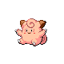

# Route 43 — Trainer Rosters

### Generic Trainers

| Trainer | P1 | P2 | P3 | P4 | P5 | P6 |
|:-------:|:--:|:--:|:--:|:--:|:--:|:--:|
|  Camper Spencer |  Parasect Lv. 38 |  Raticate Lv. 38 |  Loudred Lv. 38 |
| ") Picnicker Tiffany [(!)](#rematches) |  Clefairy Lv. 39 |  Chansey Lv. 39 |
| ") Poke Maniac Brent [(!)](#rematches) |  Raichu Lv. 39 |  Nidoking Lv. 39 |
|  Poke Maniac Beckett |  Graveler Lv. 38 |  Vibrava Lv. 38 |  Venusaur Lv. 38 |
|  Fisherman Marvin |  Huntail Lv. 39 |  Gorebyss Lv. 39 |  Tentacruel Lv. 39 |
|  Poke Maniac Ron |  Gastrodon Lv. 40 |

### Rematches

| Trainer | P1 | P2 | P3 | P4 | P5 | P6 |
|:-------:|:--:|:--:|:--:|:--:|:--:|:--:|
| ") Picnicker Tiffany (T10a-8p) |  Cleffa Lv. 44 |  Clefairy Lv. 46 |  Clefable Lv. 48 |  Chansey Lv. 48 |
| ") Picnicker Tiffany (T10a-8p) |  Cleffa Lv. 44 |  Clefairy Lv. 48 |  Clefable Lv. 52 |  Blissey Lv. 52 |
| ") Picnicker Tiffany (T10a-8p) |  Clefable Lv. 68 |  Clefable Lv. 64 |  Clefable Lv. 66 |  Blissey Lv. 68 |
| ") Poke Maniac Brent (M4a-10a) |  Wormadam Lv. 46 |  Raichu Lv. 46 |  Nidoking Lv. 46 |
| ") Poke Maniac Brent (M4a-10a) |  Gyarados Lv. 53 |  Wormadam Lv. 53 |  Nidoking Lv. 53 |  Nidoqueen Lv. 53 |
| ") Poke Maniac Brent (M4a-10a) |  Gyarados Lv. 68 |  Nidoking Lv. 68 |  Wormadam Lv. 68 |  Nidoqueen Lv. 68 |

