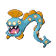

# Route 43 — Trainer Rosters

### Generic Trainers

| Trainer | P1 | P2 | P3 | P4 | P5 | P6 |
|:-------:|:--:|:--:|:--:|:--:|:--:|:--:|
|  Camper Spencer |  [Parasect](../../pokemon/parasect.md/) Lv. 38 |  [Raticate](../../pokemon/raticate.md/) Lv. 38 |  [Loudred](../../pokemon/loudred.md/) Lv. 38 |
| ") Picnicker Tiffany [(!)](#rematches) |  [Clefairy](../../pokemon/clefairy.md/) Lv. 39 |  [Chansey](../../pokemon/chansey.md/) Lv. 39 |
| ") Poke Maniac Brent [(!)](#rematches) |  [Raichu](../../pokemon/raichu.md/) Lv. 39 |  [Nidoking](../../pokemon/nidoking.md/) Lv. 39 |
|  Poke Maniac Beckett |  [Graveler](../../pokemon/graveler.md/) Lv. 38 |  [Vibrava](../../pokemon/vibrava.md/) Lv. 38 |  [Venusaur](../../pokemon/venusaur.md/) Lv. 38 |
|  Fisherman Marvin |  [Huntail](../../pokemon/huntail.md/) Lv. 39 |  [Gorebyss](../../pokemon/gorebyss.md/) Lv. 39 |  [Tentacruel](../../pokemon/tentacruel.md/) Lv. 39 |
|  Poke Maniac Ron |  [Gastrodon](../../pokemon/gastrodon.md/) Lv. 40 |

### Rematches

| Trainer | P1 | P2 | P3 | P4 | P5 | P6 |
|:-------:|:--:|:--:|:--:|:--:|:--:|:--:|
| ") Picnicker Tiffany (T10a-8p) |  [Cleffa](../../pokemon/cleffa.md/) Lv. 44 |  [Clefairy](../../pokemon/clefairy.md/) Lv. 46 |  [Clefable](../../pokemon/clefable.md/) Lv. 48 |  [Chansey](../../pokemon/chansey.md/) Lv. 48 |
| ") Picnicker Tiffany (T10a-8p) |  [Cleffa](../../pokemon/cleffa.md/) Lv. 44 |  [Clefairy](../../pokemon/clefairy.md/) Lv. 48 |  [Clefable](../../pokemon/clefable.md/) Lv. 52 |  [Blissey](../../pokemon/blissey.md/) Lv. 52 |
| ") Picnicker Tiffany (T10a-8p) |  [Clefable](../../pokemon/clefable.md/) Lv. 68 |  [Clefable](../../pokemon/clefable.md/) Lv. 64 |  [Clefable](../../pokemon/clefable.md/) Lv. 66 |  [Blissey](../../pokemon/blissey.md/) Lv. 68 |
| ") Poke Maniac Brent (M4a-10a) |  [Wormadam](../../pokemon/wormadam-plant.md/) Lv. 46 |  [Raichu](../../pokemon/raichu.md/) Lv. 46 |  [Nidoking](../../pokemon/nidoking.md/) Lv. 46 |
| ") Poke Maniac Brent (M4a-10a) |  [Gyarados](../../pokemon/gyarados.md/) Lv. 53 |  [Wormadam](../../pokemon/wormadam-plant.md/) Lv. 53 |  [Nidoking](../../pokemon/nidoking.md/) Lv. 53 |  [Nidoqueen](../../pokemon/nidoqueen.md/) Lv. 53 |
| ") Poke Maniac Brent (M4a-10a) |  [Gyarados](../../pokemon/gyarados.md/) Lv. 68 |  [Nidoking](../../pokemon/nidoking.md/) Lv. 68 |  [Wormadam](../../pokemon/wormadam-plant.md/) Lv. 68 |  [Nidoqueen](../../pokemon/nidoqueen.md/) Lv. 68 |

