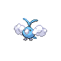

# Route 43 — Wild Pokémon

### Grass, Morning / Day

| Sprite | Pokémon | Encounter Type | Level | Chance |
|:------:|---------|:--------------:|-------|--------|
|  | Pidgeotto | {: style="max-width: 24px;"" } {: style="max-width: 24px;"" } {: style="max-width: 24px;"" } | 34 – 36 | 20% |
|  | Girafarig | {: style="max-width: 24px;"" } {: style="max-width: 24px;"" } {: style="max-width: 24px;"" } | 34 – 36 | 20% |
|  | Exeggcute | {: style="max-width: 24px;"" } {: style="max-width: 24px;"" } {: style="max-width: 24px;"" } | 34 – 36 | 10% |
|  | Kirlia | {: style="max-width: 24px;"" } {: style="max-width: 24px;"" } {: style="max-width: 24px;"" } | 34 – 36 | 10% |
|  | Swablu | {: style="max-width: 24px;"" } {: style="max-width: 24px;"" } {: style="max-width: 24px;"" } | 34 – 36 | 10% |
|  | Bibarel | {: style="max-width: 24px;"" } {: style="max-width: 24px;"" } {: style="max-width: 24px;"" } | 34 – 36 | 10% |
|  | Linoone | {: style="max-width: 24px;"" } {: style="max-width: 24px;"" } {: style="max-width: 24px;"" } | 34 – 36 | 10% |
|  | Manectric | {: style="max-width: 24px;"" } {: style="max-width: 24px;"" } {: style="max-width: 24px;"" } | 34 – 36 | 10% |

### Grass, Night

| Sprite | Pokémon | Encounter Type | Level | Chance |
|:------:|---------|:--------------:|-------|--------|
|  | Venomoth | {: style="max-width: 24px;"" } {: style="max-width: 24px;"" } | 34 – 36 | 20% |
|  | Girafarig | {: style="max-width: 24px;"" } {: style="max-width: 24px;"" } | 34 – 36 | 20% |
|  | Exeggcute | {: style="max-width: 24px;"" } {: style="max-width: 24px;"" } | 34 – 36 | 10% |
|  | Kirlia | {: style="max-width: 24px;"" } {: style="max-width: 24px;"" } | 34 – 36 | 10% |
|  | Swablu | {: style="max-width: 24px;"" } {: style="max-width: 24px;"" } | 34 – 36 | 10% |
|  | Bibarel | {: style="max-width: 24px;"" } {: style="max-width: 24px;"" } | 34 – 36 | 10% |
|  | Linoone | {: style="max-width: 24px;"" } {: style="max-width: 24px;"" } | 34 – 36 | 10% |
|  | Manectric | {: style="max-width: 24px;"" } {: style="max-width: 24px;"" } | 34 – 36 | 10% |

### Meridian Sound

| Sprite | Pokémon | Encounter Type | Level | Chance |
|:------:|---------|:--------------:|-------|--------|
|  | Altaria | {: style="max-width: 24px;"" } | 34 – 36 | 100% |

### Pastoral Sound

| Sprite | Pokémon | Encounter Type | Level | Chance |
|:------:|---------|:--------------:|-------|--------|
|  | Happiny | {: style="max-width: 24px;"" } | 34 – 36 | 50% |
|  | Chansey | {: style="max-width: 24px;"" } | 34 – 36 | 50% |

### Surf

| Sprite | Pokémon | Encounter Type | Level | Chance |
|:------:|---------|:--------------:|-------|--------|
|  | Slowpoke | {: style="max-width: 24px;"" } | 34 – 36 | 100% |

### Old Rod

| Sprite | Pokémon | Encounter Type | Level | Chance |
|:------:|---------|:--------------:|-------|--------|
|  | Magikarp | {: style="max-width: 24px;"" } | 10 | 100% |

### Good Rod

| Sprite | Pokémon | Encounter Type | Level | Chance |
|:------:|---------|:--------------:|-------|--------|
|  | Magikarp | {: style="max-width: 24px;"" } | 25 | 100% |

### Super Rod

| Sprite | Pokémon | Encounter Type | Level | Chance |
|:------:|---------|:--------------:|-------|--------|
|  | Gyarados | {: style="max-width: 24px;"" } | 50 | 100% |

