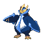

# Route 44 — Trainer Rosters

### Generic Trainers

| Trainer | P1 | P2 | P3 | P4 | P5 | P6 |
|:-------:|:--:|:--:|:--:|:--:|:--:|:--:|
|  Psychic Phil |  Xatu Lv. 45 |  Girafarig Lv. 45 |  Espeon Lv. 45 |
| ") Fisherman Wilton [(!)](#rematches) |  Wailmer Lv. 44 |  Wailmer Lv. 46 |  Wailord Lv. 48 |
|  Poke Maniac Zach |  Slowking Lv. 47 |
|  Fisherman Edgar |  Octillery Lv. 45 |  Politoed Lv. 45 |
|  Ace Trainer Cybil |  Ampharos Lv. 46 |  Bellossom Lv. 46 |  Empoleon Lv. 46 |
|  Ace Trainer Allen |  Tropius Lv. 45 |  Quagsire Lv. 45 |  Charizard Lv. 45 |  Raichu Lv. 45 |
| ") Bird Keeper Vance [(!)](#rematches) |  Noctowl Lv. 45 |  Pidgeot Lv. 45 |

### Rematches

| Trainer | P1 | P2 | P3 | P4 | P5 | P6 |
|:-------:|:--:|:--:|:--:|:--:|:--:|:--:|
| ") Fisherman Wilton (Th4a-10a) |  Wailmer Lv. 47 |  Wailmer Lv. 48 |  Wailord Lv. 49 |
| ") Fisherman Wilton (Th4a-10a) |  Wailmer Lv. 53 |  Wailord Lv. 55 |  Wailord Lv. 55 |
| ") Fisherman Wilton (Th4a-10a) |  Wailord Lv. 68 |  Wailord Lv. 68 |  Wailord Lv. 68 |
| ") Bird Keeper Vance (W8p-5a) |  Noctowl Lv. 48 |  Pidgeot Lv. 48 |
| ") Bird Keeper Vance (W8p-5a) |  Pidgeot Lv. 52 |  Staraptor Lv. 52 |  Noctowl Lv. 52 |
| ") Bird Keeper Vance (W8p-5a) |  Pidgeot Lv. 67 |  Staraptor Lv. 67 |  Noctowl Lv. 67 |

