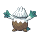
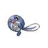

# Route 44 Wild Pokémon

### Grass, Morning / Day

| Sprite | Pokémon | Encounter Type | Level | Chance |
|:------:|---------|:--------------:|-------|--------|
|  | Tangela | {: style="max-width: 24px;"" } {: style="max-width: 24px;"" } {: style="max-width: 24px;"" } | 38 – 39 | 20% |
|  | Lickitung | {: style="max-width: 24px;"" } {: style="max-width: 24px;"" } {: style="max-width: 24px;"" } | 38 – 39 | 20% |
|  | Butterfree | {: style="max-width: 24px;"" } {: style="max-width: 24px;"" } {: style="max-width: 24px;"" } | 38 – 39 | 10% |
|  | Beedrill | {: style="max-width: 24px;"" } {: style="max-width: 24px;"" } {: style="max-width: 24px;"" } | 38 – 39 | 10% |
|  | Beautifly | {: style="max-width: 24px;"" } {: style="max-width: 24px;"" } {: style="max-width: 24px;"" } | 38 – 39 | 10% |
|  | Skiploom | {: style="max-width: 24px;"" } {: style="max-width: 24px;"" } {: style="max-width: 24px;"" } | 38 – 39 | 10% |
|  | Nuzleaf | {: style="max-width: 24px;"" } {: style="max-width: 24px;"" } {: style="max-width: 24px;"" } | 38 – 39 | 10% |
|  | Cherrim | {: style="max-width: 24px;"" } {: style="max-width: 24px;"" } {: style="max-width: 24px;"" } | 38 – 39 | 5% |
|  | Altaria | {: style="max-width: 24px;"" } {: style="max-width: 24px;"" } {: style="max-width: 24px;"" } | 38 – 39 | 4% |
|  | Vespiquen | {: style="max-width: 24px;"" } {: style="max-width: 24px;"" } {: style="max-width: 24px;"" } | 38 – 39 | 1% |

### Grass, Night

| Sprite | Pokémon | Encounter Type | Level | Chance |
|:------:|---------|:--------------:|-------|--------|
|  | Tangela | {: style="max-width: 24px;"" } {: style="max-width: 24px;"" } | 38 – 39 | 20% |
|  | Lickitung | {: style="max-width: 24px;"" } {: style="max-width: 24px;"" } | 38 – 39 | 20% |
|  | Butterfree | {: style="max-width: 24px;"" } {: style="max-width: 24px;"" } | 38 – 39 | 10% |
|  | Beedrill | {: style="max-width: 24px;"" } {: style="max-width: 24px;"" } | 38 – 39 | 10% |
|  | Dustox | {: style="max-width: 24px;"" } {: style="max-width: 24px;"" } | 38 – 39 | 10% |
|  | Venomoth | {: style="max-width: 24px;"" } {: style="max-width: 24px;"" } | 38 – 39 | 10% |
|  | Nuzleaf | {: style="max-width: 24px;"" } {: style="max-width: 24px;"" } | 38 – 39 | 10% |
|  | Snover | {: style="max-width: 24px;"" } {: style="max-width: 24px;"" } | 38 – 39 | 5% |
|  | Altaria | {: style="max-width: 24px;"" } {: style="max-width: 24px;"" } | 38 – 39 | 4% |
|  | Vespiquen | {: style="max-width: 24px;"" } {: style="max-width: 24px;"" } | 38 – 39 | 1% |

### Swarm

| Sprite | Pokémon | Encounter Type | Level | Chance |
|:------:|---------|:--------------:|-------|--------|
|  | Remoraid | {: style="max-width: 24px;"" } | 38 – 39 | 100% |

### Meridian Sound

| Sprite | Pokémon | Encounter Type | Level | Chance |
|:------:|---------|:--------------:|-------|--------|
|  | Tangrowth | {: style="max-width: 24px;"" } | 38 – 39 | 50% |
|  | Lickilicky | {: style="max-width: 24px;"" } | 38 – 39 | 50% |

### Pastoral Sound

| Sprite | Pokémon | Encounter Type | Level | Chance |
|:------:|---------|:--------------:|-------|--------|
|  | Combee | {: style="max-width: 24px;"" } | 38 – 39 | 50% |
|  | Lombre | {: style="max-width: 24px;"" } | 38 – 39 | 50% |

### Surf

| Sprite | Pokémon | Encounter Type | Level | Chance |
|:------:|---------|:--------------:|-------|--------|
|  | Lotad | {: style="max-width: 24px;"" } | 38 – 39 | 60% |
|  | Poliwag | {: style="max-width: 24px;"" } | 38 – 39 | 30% |
|  | Poliwhirl | {: style="max-width: 24px;"" } | 38 – 39 | 5% |
|  | Lombre | {: style="max-width: 24px;"" } | 38 – 39 | 5% |

### Old Rod

| Sprite | Pokémon | Encounter Type | Level | Chance |
|:------:|---------|:--------------:|-------|--------|
|  | Magikarp | {: style="max-width: 24px;"" } | 10 | 90% |
|  | Remoraid | {: style="max-width: 24px;"" } | 10 | 10% |

### Good Rod

| Sprite | Pokémon | Encounter Type | Level | Chance |
|:------:|---------|:--------------:|-------|--------|
|  | Magikarp | {: style="max-width: 24px;"" } | 25 | 60% |
|  | Remoraid | {: style="max-width: 24px;"" } | 25 | 40% |

### Super Rod

| Sprite | Pokémon | Encounter Type | Level | Chance |
|:------:|---------|:--------------:|-------|--------|
|  | Magikarp | {: style="max-width: 24px;"" } | 50 | 60% |
|  | Remoraid | {: style="max-width: 24px;"" } | 50 | 30% |
|  | Gyarados | {: style="max-width: 24px;"" } | 50 | 7% |
|  | Octillery | {: style="max-width: 24px;"" } | 50 | 3% |

