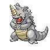

# Route 45 — Wild Pokémon

### Grass

| Sprite | Pokémon | Encounter Type | Level | Chance |
|:------:|---------|:--------------:|-------|--------|
|  | Graveler | {: style="max-width: 24px;"" } | 42 – 45 | 30% |
|  | Grumpig | {: style="max-width: 24px;"" } | 42 – 45 | 20% |
|  | Donphan | {: style="max-width: 24px;"" } | 42 – 45 | 10% |
|  | Camerupt | {: style="max-width: 24px;"" } | 42 – 45 | 10% |
|  | Torkoal | {: style="max-width: 24px;"" } | 42 – 45 | 10% |
|  | Gligar | {: style="max-width: 24px;"" } | 42 – 45 | 10% |
|  | Vibrava | {: style="max-width: 24px;"" } | 42 – 45 | 5% |
|  | Skarmory | {: style="max-width: 24px;"" } | 42 – 45 | 5% |

### Meridian Sound

| Sprite | Pokémon | Encounter Type | Level | Chance |
|:------:|---------|:--------------:|-------|--------|
|  | Gliscor | {: style="max-width: 24px;"" } | 42 – 45 | 50% |
|  | Golem | {: style="max-width: 24px;"" } | 42 – 45 | 50% |

### Pastoral Sound

| Sprite | Pokémon | Encounter Type | Level | Chance |
|:------:|---------|:--------------:|-------|--------|
|  | Rhyhorn | {: style="max-width: 24px;"" } | 42 – 45 | 50% |
|  | Vibrava | {: style="max-width: 24px;"" } | 42 – 45 | 50% |

### Swarm

| Sprite | Pokémon | Encounter Type | Level | Chance |
|:------:|---------|:--------------:|-------|--------|
|  | Rhydon | {: style="max-width: 24px;"" } | 42 – 45 | 100% |

### Surf

| Sprite | Pokémon | Encounter Type | Level | Chance |
|:------:|---------|:--------------:|-------|--------|
|  | Magikarp | {: style="max-width: 24px;"" } | 42 – 45 | 100% |

### Old Rod

| Sprite | Pokémon | Encounter Type | Level | Chance |
|:------:|---------|:--------------:|-------|--------|
|  | Magikarp | {: style="max-width: 24px;"" } | 10 | 97% |
|  | Dratini | {: style="max-width: 24px;"" } | 10 | 3% |

### Good Rod

| Sprite | Pokémon | Encounter Type | Level | Chance |
|:------:|---------|:--------------:|-------|--------|
|  | Magikarp | {: style="max-width: 24px;"" } | 25 | 97% |
|  | Dratini | {: style="max-width: 24px;"" } | 25 | 3% |

### Super Rod

| Sprite | Pokémon | Encounter Type | Level | Chance |
|:------:|---------|:--------------:|-------|--------|
|  | Magikarp | {: style="max-width: 24px;"" } | 50 | 97% |
|  | Dratini | {: style="max-width: 24px;"" } | 50 | 3% |

