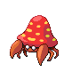

# Trainer Rosters

### Generic Trainers

| Trainer | P1 | P2 | P3 | P4 | P5 | P6 |
|:-------:|:--:|:--:|:--:|:--:|:--:|:--:|
|  Hiker Bailey |  [Geodude](../../pokemon/geodude.md/) Lv. 20 |  [Geodude](../../pokemon/geodude.md/) Lv. 20 |  [Geodude](../../pokemon/geodude.md/) Lv. 20 |  [Geodude](../../pokemon/geodude.md/) Lv. 20 |  [Geodude](../../pokemon/geodude.md/) Lv. 20 |
|  Camper Ted |  [Parasect](../../pokemon/parasect.md/) Lv. 24 |
| ") Picnicker Erin [(!)](#rematches) |  [Ponyta](../../pokemon/ponyta.md/) Lv. 22 |  [Pikachu](../../pokemon/pikachu.md/) Lv. 22 |

### Rematches

| Trainer | P1 | P2 | P3 | P4 | P5 | P6 |
|:-------:|:--:|:--:|:--:|:--:|:--:|:--:|
| ") Picnicker Erin (Sa8p-5a) |  [Rapidash](../../pokemon/rapidash.md/) Lv. 45 |  [Pikachu](../../pokemon/pikachu.md/) Lv. 45 |
| ") Picnicker Erin (Sa8p-5a) |  [Raichu](../../pokemon/raichu.md/) Lv. 53 |  [Sunflora](../../pokemon/sunflora.md/) Lv. 53 |  [Rapidash](../../pokemon/rapidash.md/) Lv. 53 |
| ") Picnicker Erin (Sa8p-5a) |  [Cherrim](../../pokemon/cherrim.md/) Lv. 68 |  [Sunflora](../../pokemon/sunflora.md/) Lv. 68 |  [Raichu](../../pokemon/raichu.md/) Lv. 68 |  [Rapidash](../../pokemon/rapidash.md/) Lv. 68 |

