# Trainer Rosters

### Generic Trainers

| Trainer | P1 | P2 | P3 | P4 | P5 | P6 |
|:-------:|:--:|:--:|:--:|:--:|:--:|:--:|
|  Team Rocket Grunt | 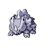 Rhyhorn Lv. 34 |  Ariados Lv. 34 | 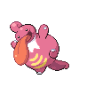 Lickilicky Lv. 34 |
|  Team Rocket Grunt |  Drowzee Lv. 34 |  Swalot Lv. 34 |  Sharpedo Lv. 34 |
|  Team Rocket Grunt |  Murkrow Lv. 35 |  Nidoqueen Lv. 35 |  Nuzleaf Lv. 35 |
|  Team Rocket Grunt |  Gloom Lv. 35 |  Loudred Lv. 35 |  Octillery Lv. 35 |
|  Team Rocket Grunt |  Houndour Lv. 35 |  Gligar Lv. 35 |  Persian Lv. 35 |
|  Team Rocket Grunt | 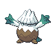 Snover Lv. 35 |  Vibrava Lv. 35 |  Fearow Lv. 35 |
|  Team Rocket Grunt |  Noctowl Lv. 36 |  Graveler Lv. 36 |  Magneton Lv. 36 |
|  Team Rocket Grunt |  Electrode Lv. 36 |  Venomoth Lv. 36 |  Misdreavus Lv. 36 |
|  Hiker Devin |  Nosepass Lv. 36 |  Probopass Lv. 38 |
|  Camper Grant |  Sandslash Lv. 37 |  Dugtrio Lv. 37 |  Jumpluff Lv. 37 |
|  Double Team Thom & Kae |  Magmortar Lv. 38 |  Electivire Lv. 38 |
| 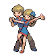 Young Couple Duff & Eda |  Cloyster Lv. 37 |  Butterfree Lv. 37 |
|  PKMN Trainer Mira | 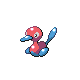 Porygon2 Lv. 35 |  Togetic Lv. 35 |  Alakazam Lv. 35 |
| 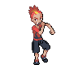 PKMN Trainer Buck | 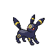 Umbreon Lv. 35 |  Torkoal Lv. 35 |  Claydol Lv. 36 |
| 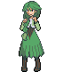 PKMN Trainer Cheryl |  Drifblim Lv. 35 | 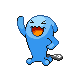 Wobbuffet Lv. 35 | 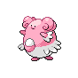 Blissey Lv. 35 |
|  PKMN Trainer Marley | 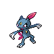 Sneasel Lv. 35 |  Ninjask Lv. 35 |  Arcanine Lv. 36 |

### Important Trainers

1. [Executive Ariana](important_trainers.md#executive-ariana)
